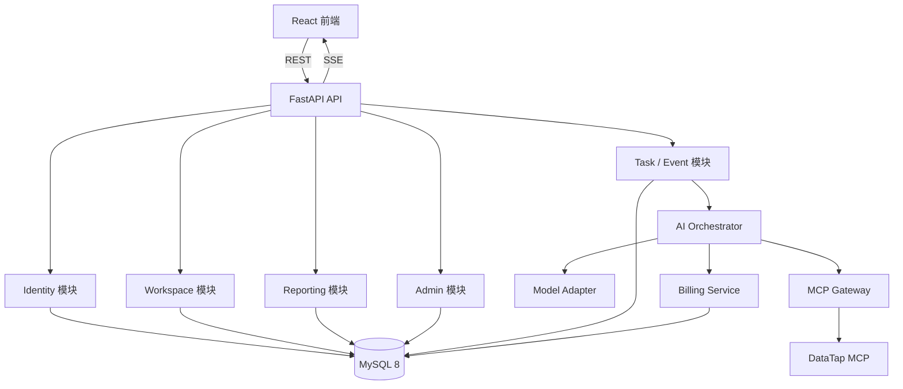

# KOL 智能选人系统总体设计

日期：2026-07-14  
状态：已批准，进入分阶段实施
目标版本：首个可用系统版本

## 1. 项目目标

本项目不是为 MCN 机构管理设计，而是为品牌方、投放人员及其他营销用户寻找、评估和管理合适的 KOL。现有 React 代码是界面原型，后续在保留其视觉风格和交互习惯的前提下，建设完整系统。

用户应能够完成以下闭环：

1. 创建一个 KOL 选人任务，填写产品、渠道、品类、预算、受众和其他筛选条件。
2. 通过自然语言继续补充或修改选人要求。
3. 由 AI 自动生成结构化执行计划，并调用 DataTap MCP 获取真实数据。
4. 在会话中查看工具执行进度、数据结果和分析结论。
5. 获取可排序、筛选、收藏和对比的 KOL 候选清单。
6. 在右侧固定 BI 面板查看受众契合、内容表现、商业价值、预算和风险等指标。
7. 保存并恢复所有历史会话、候选结果、BI 报告和积分消费记录。

## 2. 已确认约束

- 预期注册用户约 100 人。
- 同时在线用户和同时执行的分析任务均不超过 10。
- 基础架构采用异步流式模块化单体，并为后续 Worker 和微服务化预留边界。
- 前端继续使用现有 React、TypeScript、Vite、Tailwind CSS、Lucide React 和 Recharts。
- 后端使用 Python 与 FastAPI。
- 数据库使用本机安装的 MySQL 8。
- AI 大模型通过通用适配层接入，不把业务绑定到单一供应商。
- 三方数据通过 DataTap MCP 接入。
- Google Trends 不接入本系统，不配置对应 MCP 服务，也不向 AI 编排器暴露相关工具。
- 每个 MCP 工具成功响应计 1 次，扣除 10 积分；失败不扣费。
- 新用户首次注册赠送 1000 积分。
- 真实充值、短信验证码和微信 OAuth 不属于首期范围。
- 开发和测试阶段使用受控的模拟认证。
- UI 布局可以扩展，但必须保持现有原型的视觉风格、按钮、图标和交互质感。

## 3. 总体架构

首期所有 Python 模块位于同一代码库和部署单元，但必须通过明确的服务接口协作。API 路由不能直接修改钱包、直接调用 DataTap 或直接拼装供应商 Prompt。

未来需要扩展时，保持 REST/SSE 接口和任务数据模型不变，引入 Redis 或消息队列，把任务执行接口迁移到独立 Worker。进一步扩展时可分别拆出 AI 编排、MCP Gateway 或计费服务。

## 4. 后端模块边界

### 4.1 Identity

负责用户、登录身份、角色、渠道权限和登录会话。首期角色为 `user` 和 `admin`。

开发测试阶段使用 `AUTH_MODE=mock`：

- 短信登录使用固定或后端生成的模拟验证码。
- 微信登录使用模拟授权回调。
- 模拟认证仍通过正式登录 API，创建真实 MySQL 用户、登录会话和钱包。
- 模拟认证仅允许在开发和测试环境使用；生产环境检测到模拟模式时拒绝启动。

后续真实登录通过 `SmsAuthProvider` 和 `WechatAuthProvider` 接入，不改变前端流程和领域模型。

### 4.2 Workspace

负责选人会话、消息、筛选快照、候选清单、排序状态和用户收藏。所有读写必须带当前认证用户的 `user_id`。

### 4.3 Task / Event

每次用户提问或首次创建选人任务都生成持久化 `analysis_task`。任务状态包括：

- `pending`
- `planning`
- `running`
- `completed`
- `failed`
- `interrupted`
- `insufficient_balance`
- `cancelled`

任务事件写入 `task_events`，并通过 SSE 推送。客户端重连时使用 `Last-Event-ID` 补发遗漏事件。

### 4.4 AI Orchestrator

负责意图理解、上下文构建、结构化工具计划、MCP 调度、结果归一化、KOL 评分、BI 数据生成和自然语言总结。

大模型只负责理解、规划和总结。工具许可、参数校验、积分、数据库写入、重试和状态流转全部由 Python 后端控制。

### 4.5 Model Adapter

对外暴露统一的规划、结构化生成和流式文本接口，隐藏具体模型 SDK。模型名称、密钥、超时和温度等通过服务端配置注入。

模型调用本身首期不从用户积分中扣费；积分仅对应 DataTap MCP 成功调用。

### 4.6 MCP Gateway

统一封装所有 DataTap MCP 工具，提供：

- 工具白名单和渠道权限过滤。
- 输入 Schema 校验和参数规范化。
- 并发、超时、输出大小和重试限制。
- 稳定的内部工具名称与三方工具映射。
- 原始响应留存、标准化结果和可审计调用记录。
- 幂等控制，防止恢复或重试造成重复调用和重复扣费。

MCP 返回内容一律视为不可信外部数据，不能改变系统规则、调用管理接口或修改积分。

### 4.7 Billing Service

Billing Service 是唯一可以修改积分可用余额和预留余额的模块。管理员也必须通过 Billing Service 调整积分，不能直接更新钱包余额。

### 4.8 Reporting

负责 KOL 选人指标、BI 报告版本、候选对比、导出数据和数据证据。报告不是单一可覆盖字段，而是按任务保存版本。

### 4.9 Admin

负责用户、角色、渠道权限、积分调整、任务状态、MCP 调用和审计日志。所有管理员操作记录操作人、目标对象、变更前后值和时间。

## 5. AI、Prompt 与 MCP 执行流

一次分析任务按以下顺序执行：

1. 保存用户消息并创建 `analysis_task`。
2. Context Builder 组合系统规则、用户筛选条件、近期消息、会话摘要、已有候选和工具目录。
3. Planner 模型输出符合 JSON Schema 的工具计划。
4. 后端校验工具白名单、渠道权限、参数、依赖关系和单任务调用上限。
5. 对可并行批次进行积分预留。
6. MCP Gateway 按依赖分批并行执行工具。
7. 每个成功响应结算 10 积分；错误或超时释放对应预留积分。
8. Normalizer 把三方结果映射到统一 KOL、受众、内容、商业和风险结构。
9. Scoring Service 计算候选排序和分项得分。
10. Analyst 模型根据结构化数据生成解释和结论。
11. 保存候选清单、BI 报告、AI 消息和数据证据。
12. 整个过程中通过 SSE 增量更新前端。

Prompt 由以下部分组成：

- 固定系统规则与安全约束。
- 当前用户可使用的工具目录。
- 产品简报、渠道、预算、受众和筛选条件。
- 最近会话消息、压缩摘要和已有候选。
- 目标 JSON Schema。
- Prompt 模板版本号。

首期单任务默认最多允许 10 次 MCP 工具调用，管理员可配置上限。规划阶段向前端返回预计调用次数和预计积分。

## 6. 实时积分规则

计费规则与 DataTap 保持一致：

- 每成功响应一个 MCP 工具函数，计 1 次调用并扣除 10 积分。
- 同一请求并行调用多个工具，每个工具分别计费。
- 同一工具被重复调用，每次成功响应分别计费。
- 调用返回错误或超时不计费。
- 余额不足时不执行尚未开始的调用。

为避免并行任务透支，每个 MCP 调用使用以下状态：

1. `planned`
2. `reserved`：冻结 10 点可用积分。
3. `running`
4. `settled`：成功，预留转正式消费。
5. `released`：失败，释放预留积分。

并行批次执行前一次性预留该批次所需积分。钱包使用 MySQL 行锁、`version` 字段和幂等键防止并发透支或重复结算。

新用户赠送的 1000 积分必须通过 `welcome_grant` 账本交易入账。充值功能暂时保留原型，不接真实支付。

## 7. 数据模型

### 7.1 身份与权限

- `users`
- `auth_identities`
- `user_channel_permissions`
- `user_sessions`
- `admin_audit_logs`

### 7.2 钱包与账本

- `wallets`：`balance`、`reserved`、`version`
- `wallet_transactions`：赠送、预留、结算、释放、管理员调整

账本记录具有唯一幂等键、关联业务对象、变动数量和变动后余额。

### 7.3 会话与任务

- `sessions`
- `messages`
- `analysis_tasks`
- `task_events`
- `model_runs`
- `mcp_calls`

`sessions.user_id` 表示会话所属用户。会话保存标题、状态、筛选快照、收藏、最近访问时间、最新任务和最新报告引用。

### 7.4 KOL 与报告

- `kols`
- `kol_snapshots`
- `task_candidates`
- `user_kol_favorites`
- `bi_reports`

`kols` 使用平台与三方 KOL ID 作为唯一业务键。`kol_snapshots` 保存历史指标和原始 JSON；`task_candidates` 保存特定任务中的排名、总分、分项得分和推荐理由。

## 8. 会话历史与恢复

用户重新登录后按 `user_id` 查询其历史会话。打开会话时恢复：

- 完整消息记录。
- 创建任务时的筛选条件。
- 最新候选清单及排序。
- 用户收藏状态。
- 最新 BI 报告和历史报告版本。
- MCP 调用及积分消费记录。

已完成会话可以直接继续提问并生成新任务。执行中断的任务从最后安全检查点恢复：

- 已成功的 MCP 调用复用持久化结果，不重复调用或扣费。
- 已失败或未执行步骤进入待重试状态。
- SSE 根据事件 ID 重放断线期间事件。

普通用户无法通过猜测会话 ID 访问其他用户数据。管理员访问用户会话必须通过独立审计接口。

## 9. 前端产品设计

### 9.1 左侧栏

- 创建新的 KOL 选人任务。
- 搜索、收藏和恢复历史会话。
- 显示任务状态、最近访问时间和候选数量。
- 显示当前用户、积分余额和本次任务消费。

### 9.2 中间工作区

顶部显示渠道、品类、受众、预算等筛选条件，并提供高级筛选入口。

中间包含：

- `智能会话`：自然语言提问、模型回复、工具进度和证据。
- `候选清单`：排序、筛选、收藏、详情和勾选对比。
- `已收藏`：跨任务保存的用户 KOL 收藏。

候选清单至少展示 KOL、平台、内容标签、粉丝、互动率、报价、匹配总分、分项得分、数据时间和推荐理由。

### 9.3 右侧固定 BI

BI 面板在桌面端固定显示，包含：

- 选人概览。
- 匹配度构成。
- 受众和内容契合度。
- 平台、预算和报价分布。
- 候选对比。
- 商业饱和度和品牌安全风险。
- AI 结论。
- MCP 数据来源及更新时间。

窄屏时右侧 BI 变为抽屉，左侧栏可折叠。

## 10. 原型视觉保留

实现阶段保留以下视觉特征：

- 三栏比例、白色主背景和轻边框。
- Indigo 600/700 主色与 Slate 中性色。
- Lucide React 线性图标，尺寸 14–18px。
- 28–32px 紧凑图标按钮与 `rounded-lg`。
- 11–13px 正文和 9–10px 辅助信息密度。
- SessionList、ChatArea、BiReport、NewSessionModal、LoginPage 和 AdminPanel 的现有视觉结构。
- 现有 Hover、Active、弹窗 Motion 动效和 Recharts 图表风格。

不引入另一套 UI 组件库视觉，不进行大字号、宽松卡片或营销官网式重构。实现时建立关键页面视觉回归截图。

## 11. API 与 SSE 轮廓

主要 API 分组：

- `/api/v1/auth/*`
- `/api/v1/users/me`
- `/api/v1/sessions/*`
- `/api/v1/sessions/{session_id}/messages`
- `/api/v1/tasks/*`
- `/api/v1/tasks/{task_id}/events`
- `/api/v1/tasks/{task_id}/candidates`
- `/api/v1/kols/{kol_id}`
- `/api/v1/favorites/*`
- `/api/v1/reports/*`
- `/api/v1/wallet/*`
- `/api/v1/admin/*`

SSE 事件至少包括：

- `plan.ready`
- `tool.started`
- `tool.succeeded`
- `tool.failed`
- `points.reserved`
- `points.settled`
- `points.released`
- `candidates.updated`
- `bi.updated`
- `message.delta`
- `task.completed`
- `task.failed`

## 12. 错误处理

统一错误码包括：

- `INSUFFICIENT_POINTS`
- `MCP_TIMEOUT`
- `MCP_ERROR`
- `MODEL_ERROR`
- `TASK_INTERRUPTED`
- `AUTH_EXPIRED`
- `CHANNEL_FORBIDDEN`
- `VALIDATION_ERROR`

MCP 失败释放预留积分。模型总结失败时保留已获取并已计费的 MCP 数据，只重新执行总结。生产环境不允许把模拟分析数据展示为真实结果；如保留演示数据，必须持续显示醒目的模拟标志。

## 13. 本地开发与部署

本地开发直接使用已安装的 MySQL：

- `MYSQL_HOST=127.0.0.1`
- `MYSQL_PORT=3306`
- `MYSQL_DATABASE=kol_insight`
- `MYSQL_USER=root`（仅限本地开发）
- `MYSQL_PASSWORD` 只放入未提交的 `.env`

`.env.example` 只提供占位符，禁止提交真实数据库密码、DataTap 令牌或模型密钥。生产环境使用独立的最小权限数据库账户。

首期运行单元：

- React 开发服务器或静态产物。
- FastAPI 应用。
- 本地 MySQL 8。

部署环境可使用 Nginx 统一 HTTPS、静态资源和 API/SSE 反向代理。首期不引入 Redis；服务启动时扫描 `running` 和 `interrupted` 任务并恢复。

当并发分析任务显著超过 10 或出现大量分钟级任务时，引入 Redis/消息队列和独立 Worker。前端 API、SSE 事件、任务表和服务接口保持不变。

## 14. 安全与可观测性

- 所有资源访问执行 `user_id` 数据隔离。
- 管理接口强制校验管理员角色。
- 三方密钥只存在服务端配置中。
- MCP 工具执行白名单、参数 Schema、超时、并发和输出限制。
- 所有积分变化、管理员操作和 MCP 调用可审计。
- 日志中脱敏手机号、Token、Prompt 中的隐私字段和三方凭证。
- 监控任务量、任务耗时、MCP 成功率、积分平衡、模型错误率和 SSE 重连次数。

## 15. 测试策略

### 单元测试

- Prompt 组装。
- 工具计划验证。
- KOL 评分与排序。
- 钱包状态机。
- 权限和数据隔离。

### 集成测试

- MySQL 迁移和事务。
- 并发积分预留与结算。
- 幂等重试。
- 会话和任务恢复。
- 模拟认证。

### 契约测试

- 使用模拟 MCP Server 验证参数和结果归一化。
- 使用固定模型响应验证 JSON Schema 和降级处理。

### 端到端测试

- 模拟登录和新用户 1000 积分。
- 新建选人任务。
- MCP 成功、失败、重复和并行调用。
- 候选排序、收藏和对比。
- BI 增量更新。
- 断线重连和会话恢复。
- 管理员用户、权限和账本操作。

### 非功能测试

- 至少 10 个并发分析任务。
- 核心页面视觉回归。
- 敏感信息泄漏检查。
- 钱包与账本一致性检查。

## 16. 明确不在首期实现的内容

- 真实短信服务。
- 真实微信 OAuth。
- 真实支付和充值渠道。
- Redis、Celery 或独立 Worker。
- 多租户组织和企业层级。
- 超出当前 DataTap 授权范围的数据供应商。
- Google Trends MCP 服务及相关数据渠道。

这些能力均通过适配器、任务接口和账本模型预留扩展点，但不阻塞首期核心选人能力。

## 17. 已知外部依赖风险

DataTap MCP 工具已注册，但此前实际调用“达人精选”服务返回过积分不足。开始真实 MCP 联调前，需要确保 DataTap 账户有可用额度。知乎、头条和百度指数还依赖额外设备标识及对应网站登录，不作为首期 KOL 核心链路的强依赖。Google Trends 已明确排除，不纳入系统配置或工具目录。

## 18. 验收标准

首期系统完成时应满足：

1. 用户可以通过模拟认证登录并获得 1000 初始积分。
2. 每个用户只能访问自己的历史会话和结果。
3. 用户可以通过筛选条件和自然语言发起 KOL 选人任务。
4. Python 后端能够规划并执行 DataTap MCP 工具。
5. 成功 MCP 调用准确扣除 10 积分，失败调用不扣费。
6. 前端实时展示工具进度、积分变化、候选结果和 BI。
7. KOL 候选清单支持排序、收藏和对比。
8. 会话、任务、候选和 BI 在重新登录或服务重启后可以恢复。
9. 管理员可以管理用户、渠道权限、积分和审计记录。
10. 前端保持现有原型的界面风格、按钮和图标体系。
11. 类型检查、后端测试、集成测试、10 并发测试和关键 E2E 流程通过。
