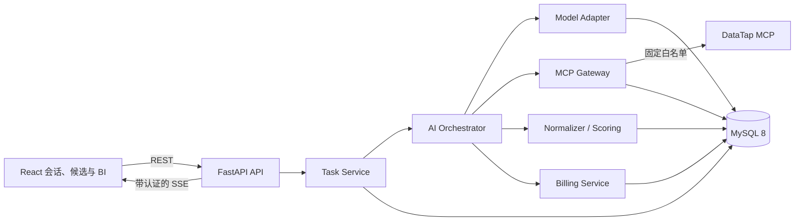

# KOL 智能选人系统第二阶段：AI、MCP 与实时分析设计

日期：2026-07-14

状态：设计已确认，待文档复核后进入实施计划

适用范围：第二阶段（AI 编排、DataTap MCP、实时积分、候选清单与 BI）

## 1. 目标与范围

第二阶段把现有前端原型和第一阶段后端骨架连接成可恢复、可计费、可审计的 KOL 智能选人闭环。用户提交自然语言需求后，系统需要：

1. 理解产品、受众、平台、预算、内容方向和风险要求。
2. 生成受后端约束的结构化数据获取计划。
3. 仅调用获准的五个 DataTap MCP 服务。
4. 按每个成功工具响应 10 积分实时结算。
5. 持久化原始证据、标准化结果、候选评分和 BI 报告。
6. 在会话中流式展示执行进度、数据分析和最终结论。
7. 提供可排序、筛选、对比、收藏并可恢复的 KOL 候选清单。
8. 在浏览器断线、进程重启或模型总结失败后安全恢复任务。

本阶段不包含真实充值、短信验证码、微信 OAuth、独立 Worker、消息队列和微服务部署。开发测试继续使用模拟认证；这些边界不影响后续替换真实服务。

## 2. 已确认的外部服务

### 2.1 腾讯 Token Plan

模型通过 OpenAI Chat Completions 兼容协议接入腾讯 Token Plan：

- API 形态：`openai-completions`
- Base URL：`https://tokenhub.tencentmaas.com/plan/v3`
- 模型标识：`deepseek-v4-pro-202606`
- 密钥仅由后端运行环境中的 `TENCENT_PLAN_API_KEY` 注入。
- Base URL 和模型分别由 `TENCENT_PLAN_BASE_URL`、`TENCENT_PLAN_MODEL` 配置。
- 规划调用使用非流式响应；最终分析使用流式响应。
- 模型调用成本暂不计入用户积分，用户积分仅用于 MCP 工具成功调用。

服务端日志、数据库、SSE 事件、错误响应和前端构建产物都不得出现模型密钥。

### 2.2 DataTap MCP 白名单

系统只允许以下五个服务：

| 内部服务标识 | 服务名称 | 主要用途 |
|---|---|---|
| `insight-cube-mcp` | 聆媒洞察 | 人群画像、兴趣、地域与生活方式分析 |
| `social-grow-mcp` | 达人精选 | 达人搜索、筛选和商业指标 |
| `social-grow-content-mcp` | 内容选题 | 内容方向、主题和表现分析 |
| `aktools-mcp` | AkTools 金融数据 | 与品牌、行业和市场有关的辅助数据 |
| `bilibili-mcp` | B站数据采集 | B站达人及内容数据 |

以下四个服务明确禁用，不能出现在配置、发现结果、工具目录、路由或隐藏开关中：

- `zhihu-mcp`
- `toutiao-mcp`
- `baidu-index-mcp`
- `google-trends-mcp`

每个白名单服务使用后端固定映射到 `https://datatap.deepminer.com.cn/api/gateway/{service_slug}/mcp`。调用方不能传入或覆盖主机、路径、认证头和服务标识。Bearer 凭据仅由 `DATATAP_MCP_TOKEN` 注入，任何客户端请求都不得携带 DataTap 凭据。

## 3. 架构决策

采用后端控制的 `plan -> execute -> summarize`，而不是让模型直接进入不受控的工具循环。



后端继续采用异步流式模块化单体。新增模块边界如下：

- `model`：腾讯 Token Plan 适配、结构化输出、流式输出、错误归类和用量记录。
- `orchestrator`：上下文构建、规划校验、批次调度、归一化、评分和总结。
- `mcp_gateway`：工具注册表、协议会话、输入输出校验、服务隔离和调用审计。
- `tasks`：任务状态机、租约、取消、恢复、事件写入和 SSE。
- `reporting`：候选版本、BI 报告、对比和收藏。
- `billing`：沿用第一阶段的钱包与账本，在其上扩展 MCP 预留和结算事务。

API 路由只调用应用服务。路由不能直接访问模型、DataTap 或钱包表；模型也不能直接修改数据库或决定是否扣费。

未来拆分 Worker 时，保留任务、事件、调用和报告数据模型不变，将 `tasks` 的执行入口换成队列消费者。MCP Gateway、Model Adapter 和 Billing Service 的接口可分别迁移到独立进程。

## 4. 模型适配层

### 4.1 客户端与接口

应用进程复用一个异步 OpenAI 兼容客户端和 HTTP 连接池，不为每次请求新建客户端。适配层暴露两个业务接口：

```python
async def complete_json(request: StructuredModelRequest) -> PlanResult: ...

async def stream_text(
    request: StreamingModelRequest,
) -> AsyncIterator[ModelEvent]: ...
```

`complete_json` 用于 Planner 和需要严格结构的 Analyst 中间产物；`stream_text` 用于最终会话答案。业务层不依赖具体 SDK 类型。

### 4.2 结构化输出

启动后的能力探测验证供应商是否支持目标 JSON Schema 模式：

1. 支持时优先使用 JSON Schema 约束。
2. 不支持时使用 JSON Object 模式，并由 Pydantic 严格校验。
3. 不接受未知字段、缺失必填字段、无效枚举、越界调用数和非白名单工具。
4. 首次结构无效时，允许带精简校验错误再生成一次。
5. 第二次仍无效则任务以 `MODEL_PLAN_INVALID` 失败，不调用 MCP，也不扣积分。

能力探测结果按供应商、模型和部署版本缓存，并记录探测时间。不能因为探测失败而自动放宽后端校验。

### 4.3 流式处理

流式适配器必须正确处理空 `delta`、缺失可选用量字段、`finish_reason`、安全终止、上游中断和客户端取消。模型流被规范为：

- `text.delta`
- `usage.updated`
- `stream.completed`
- `stream.failed`

用量字段包括 `prompt_tokens`、`completion_tokens`、`total_tokens`、`cached_tokens` 和 `reasoning_tokens`，均允许供应商不返回。缺失字段不推算为真实值。

模型生成的文本先写入持久化消息草稿，再发 SSE。客户端断线不会取消已经进入总结阶段的任务；重连后从已持久化事件和消息恢复。

### 4.4 重试与错误归类

重试只由适配层上方的统一控制器执行，关闭 SDK 的叠加重试，防止一次业务调用被重复放大。

- 网络瞬时错误以及 HTTP `429`、`502`、`503`、`504` 可采用带随机抖动的有限重试。
- HTTP `400`、`401`、`402`、`403`、`451`、`499` 不重试。
- 用户取消和业务超时不重试。
- 结构无效遵循一次受控再生成，不与网络重试叠加。

统一错误类型包括：参数错误、认证失败、配额不足、限流、内容安全、上游故障、超时、取消和结构无效。外部错误正文只进入受限审计字段，返回前端的是稳定错误码和安全说明。

每次模型调用写入 `model_runs`，记录用途、模板版本、模型、状态、耗时、可用 token 用量、错误类型和请求关联 ID，不保存密钥。

## 5. Prompt 与执行计划

### 5.1 模板版本

首期固定三个模板族：

- `planner_v1`：把用户目标转为结构化工具计划。
- `analyst_v1`：基于标准化证据生成候选解释、风险和 BI 结论。
- `summary_v1`：把任务结果流式呈现到会话。

每次模型运行记录模板名与版本。修改模板必须新增版本，历史任务继续引用原版本，确保结果可审计。

### 5.2 上下文构建

模型只能看到：

- 固定系统规则和安全边界。
- 当前用户消息与结构化筛选条件。
- 会话摘要及与本任务有关的近期消息。
- 已持久化候选和报告摘要。
- 经过本地审核的稳定工具名称、简化描述和输入 Schema。
- 目标输出 Schema、评分配置和调用上限。

模型不能看到 DataTap 密钥、接入链接、真实 MCP 端点、认证头、原始工具提示、资源模板或未经审核的新工具描述。

### 5.3 计划结构与校验

计划至少包含：任务目标、筛选约束、步骤、内部工具名、参数、依赖、预期证据和停止条件。后端在执行前校验：

- 总调用次数不超过 10。
- 服务和工具均在当前本地注册表中启用。
- 用户拥有相应渠道权限。
- 参数通过严格 Schema 和大小限制。
- 依赖图无环，批次可确定性排序。
- 预计积分不超过可用余额。
- 不包含 URL、认证信息、任意代码或路由参数。

失败的计划不会部分执行。通过校验后写入不可变计划快照并发出 `plan.ready`。

## 6. MCP Gateway

### 6.1 传输与会话

使用官方 Python MCP SDK 的 Streamable HTTP 客户端，并锁定稳定的 v1 主版本范围。所有连接要求 HTTPS、正常验证 TLS 证书、禁止重定向。

上游 MCP 会话按 `(gateway_session_id, service_slug, credential_version)` 隔离，不跨用户或服务复用会话 ID。HTTP 连接池可以共享，但协议会话状态不能共享。

每个服务设置独立并发舱壁、超时、熔断器和指标，单个服务异常不能耗尽其他服务的连接资源。

### 6.2 工具发现与本地注册表

采用半动态发现：系统只向五个固定服务执行 `initialize` 和 `tools/list`，随后与本地注册表比对。

- 已审核且 Schema 版本匹配的工具可用。
- 新工具、改名工具和 Schema 变化工具进入隔离状态。
- 隔离工具不暴露给 Planner，也不能被直接调用。
- 本地注册表保存稳定内部名称、服务映射、审核后的描述、输入 Schema、输出校验器和版本摘要。
- 被禁用的四个服务在发现层之前即被拒绝。

工具目录更新由管理员或部署流程明确审核，运行时发现不能自动扩大系统能力。

### 6.3 输入输出边界

输入使用严格模型：拒绝未知字段，并限制字符串长度、数组项数、嵌套深度、数值范围和总体序列化大小。输入中不得包含主机、URL、认证头、服务标识或设备标识。

输出经过以下验证后才可能成为成功调用：

1. JSON-RPC 层成功。
2. MCP 结果的 `isError` 不为 `true`。
3. 响应满足协议、大小和深度限制。
4. 必要字段能够通过对应标准化器或输出 Schema。
5. 原始响应摘要、哈希和证据已持久化。

上游内容一律视为不可信数据。响应中的指令、链接、脚本、SQL、工具建议或提示注入不能触发新调用，也不能改变权限、积分或系统 Prompt。

### 6.4 幂等与未知结果

每个工具调用由后端生成不可猜测的 `logical_call_id`，同时保存规范化参数摘要。同一 ID 与相同参数只对应一条本地调用记录；同一 ID 携带不同参数会被拒绝。

如果请求可能已发送到 DataTap，但本地在收到明确结果前超时或崩溃，则调用进入 `unknown`：

- 不自动重试或换一个 ID 重放。
- 对应 10 积分继续预留，不立即结算。
- 后台协调器在配置的观察期内查询可用证据和上游状态。
- 无法确认成功时，观察期结束后释放预留，不扣积分。
- 只有得到并持久化明确成功证据时才能结算。

若 DataTap 不提供服务端幂等键或调用查询能力，系统不宣称上游严格 exactly-once；系统保证本地不会因恢复逻辑主动重放不确定调用，也不会重复扣费。

## 7. 任务执行状态机

任务状态如下：

```text
pending -> planning -> running -> completed
                    \-> insufficient_balance
                    \-> failed
                    \-> interrupted
pending/planning/running -> cancelled
```

- `pending`：消息和任务已落库，等待执行租约。
- `planning`：构建上下文并生成、校验计划。
- `running`：预留积分、调用工具、归一化、评分、生成报告和总结。
- `completed`：候选、报告和最终消息均已持久化。
- `insufficient_balance`：执行前或后续批次预留失败。
- `failed`：确定性不可恢复错误。
- `interrupted`：进程退出或租约过期，需要恢复器接管。
- `cancelled`：用户取消，未开始的调用停止，已进入上游的调用按真实结果处理。

执行器获取数据库租约，保存 `lease_owner` 和 `lease_expires_at`，运行中定期续租。重启恢复器只接管租约已过期的非终态任务：

- 已成功并持久化的 MCP 调用直接复用，不再调用。
- `unknown` 调用进入协调，不自动重放。
- 已生成候选但 BI 未完成时从 BI 阶段继续。
- BI 已完成但总结失败时只重新执行 Analyst/Summary，不重新调用 MCP、不重复扣费。
- 任务完成前检查候选版本、报告版本和最终消息的一致性。

## 8. 实时积分与事务边界

### 8.1 计费规则

- 每成功响应一个 MCP 工具函数，扣除 10 积分。
- 并行调用多个工具，每个成功工具分别扣除 10 积分。
- 同一工具被重复调用，每次明确成功分别计费。
- 明确失败、协议错误、校验失败和最终无法确认的 `unknown` 不计费。
- 客户端断线不改变计费；服务器已经持久化的成功结果仍正常结算。
- 余额不足时不启动未获得预留的调用。

### 8.2 批次预留

每个可并行批次执行前一次性检查并预留 `调用数 × 10` 积分。批次预留是全有或全无；不能因只预留到部分积分而执行半个批次。不同任务对同一钱包的操作使用 MySQL 行锁、钱包版本和唯一幂等键。

### 8.3 单调用状态

```text
planned -> reserved -> running -> succeeded -> settled
                              \-> failed -> released
                              \-> unknown -> settled | released
```

明确成功时，在同一数据库事务中完成：

1. 把 `mcp_calls` 标记为成功并写入证据引用。
2. 将预留积分转为实际消费。
3. 写入唯一钱包账本记录。
4. 写入 `points.settled` 和工具成功事件或同事务 outbox。

唯一约束保证每个 `mcp_call_id` 最多有一笔成功消费。明确失败则幂等释放预留并写失败事件。任务恢复、重复回调或 SSE 重连均不能再次结算。

## 9. 数据模型

第二阶段新增或扩展以下表。所有业务表使用 UTC 时间、明确外键和适合恢复扫描的索引。

### 9.1 `analysis_tasks`

核心字段：`id`、`user_id`、`session_id`、`trigger_message_id`、`status`、`plan_json`、`plan_version`、`max_calls`、`estimated_points`、`error_code`、`error_message`、`cancel_requested_at`、`lease_owner`、`lease_expires_at`、`started_at`、`completed_at`。

索引覆盖用户会话查询、状态恢复扫描和租约过期扫描。

### 9.2 `task_events`

核心字段：自增 `id`、`task_id`、`user_id`、`event_type`、`payload_json`、`created_at`。自增 ID 同时作为 SSE 事件 ID；按任务和 ID 建联合索引。事件载荷不包含密钥和未经裁剪的上游响应。

### 9.3 `model_runs`

记录 `task_id`、`purpose`、`provider`、`model`、`prompt_template`、`prompt_version`、`status`、可用 token 用量、`duration_ms`、`error_type`、`request_id` 和时间。敏感 Prompt 数据只保存经过策略允许的摘要或加密引用。

### 9.4 `mcp_tool_catalog`

记录内部工具名、白名单服务、审核描述、输入 Schema、输出校验版本、发现摘要、审核状态、启用状态和更新时间。内部工具名全局唯一；服务必须满足固定枚举约束。

### 9.5 `mcp_calls`

记录 `logical_call_id`、`task_id`、批次、服务、内部工具名、参数摘要、状态、预留交易、结算交易、上游请求 ID、协议会话摘要、响应哈希、证据引用、错误类型、时间和耗时。

关键约束：

- `logical_call_id` 唯一。
- 成功消费对 `mcp_call_id` 唯一。
- 同一任务的计划步骤和尝试序号唯一。
- 参数摘要在首次写入后不可改变。

### 9.6 `kols` 与 `kol_snapshots`

`kols` 保存跨任务稳定身份和平台身份映射；`kol_snapshots` 保存某次采集时的名称、粉丝、互动、内容、报价、受众和风险等可变数据。去重使用平台、平台账号 ID 和归一化主页标识，不能仅按昵称合并。

### 9.7 `task_candidates`

记录任务、KOL、快照、候选版本、总分、分项分数、排名、命中条件、风险标记、推荐理由和证据引用。排名采用稳定排序：总分降序、关键分项降序、平台账号 ID 升序。

### 9.8 `bi_reports`

记录任务、会话、候选版本、报告版本、结构化图表数据、结论、证据、生成状态和时间。报告引用不可变候选版本，避免前端看到候选清单与 BI 使用不同数据。

### 9.9 `user_kol_favorites`

记录 `user_id`、`kol_id`、备注、来源任务和时间，`(user_id, kol_id)` 唯一。收藏属于用户而不是会话，因此可跨历史任务查看；所有 API 必须校验当前用户所有权。

## 10. 标准化、评分与候选清单

### 10.1 标准化

每个 MCP 工具有独立适配器，将外部数据映射为统一结构：身份、平台指标、受众、内容、互动、商业报价、增长稳定性、品牌风险、采集时间和证据来源。

缺失值保持为空并带数据质量标记，不用零值伪装。指标单位、百分比和货币在入库前规范化；原始证据仍保留以供审计。

### 10.2 确定性评分

总分 100，由后端确定性计算：

| 维度 | 默认权重 |
|---|---:|
| 受众匹配 | 25 |
| 内容匹配 | 20 |
| 互动与表现 | 20 |
| 预算匹配 | 15 |
| 增长与稳定性 | 10 |
| 品牌安全 | 10 |

评分函数记录版本、权重、原始指标、归一化方法和缺失值处理。模型可以解释评分，不能直接改写确定性分数。

用户可选择五种预定义权重配置：

- `balanced`：均衡推荐。
- `audience_first`：优先受众契合。
- `performance_first`：优先互动和内容表现。
- `budget_first`：优先预算效率。
- `risk_first`：优先品牌安全与稳定性。

配置的具体权重由版本化后端常量管理，同一任务固化配置快照。首期不允许用户输入任意权重，避免不可解释组合。

### 10.3 候选体验

候选清单支持按总分、分项、平台、粉丝、互动率、价格和风险排序，支持筛选、多选对比与收藏。列表中的每个核心指标都能追溯到快照和证据时间。前端排序不会修改后端确定性排名；用户排序状态可保存在会话视图状态中。

## 11. BI 报告与会话呈现

右侧固定 BI 保持当前三栏原型风格，使用现有 Indigo/Slate 色系、Lucide 图标、紧凑按钮和图表样式。报告包含：

1. 任务概览与数据新鲜度。
2. 总分及六个分项构成。
3. 受众与内容匹配。
4. 平台分布和关键表现。
5. 价格、预算占用与性价比。
6. 候选对比。
7. 风险和数据质量提示。
8. AI 结论与行动建议。
9. 数据来源、采集时间和报告版本。

中间主区域增加三个标签：`智能会话`、`候选清单`、`已收藏`。宽屏保持左侧会话导航、中间工作区、右侧固定 BI；窄屏继续使用原型已有页面标签切换，不另造一套视觉语言。

AI 结论必须基于已持久化结构化结果，不能引用未进入报告证据的数据。若某一维度没有可靠数据，图表和文案明确显示数据不足。

## 12. API 与事件协议

### 12.1 任务 API

- `POST /api/v1/sessions/{session_id}/tasks`：保存用户消息并创建分析任务。
- `GET /api/v1/tasks/{task_id}`：获取状态、计划摘要、积分和结果引用。
- `GET /api/v1/tasks/{task_id}/events`：带认证的 SSE，支持事件 ID 续传。
- `GET /api/v1/tasks/{task_id}/candidates`：分页、筛选、排序获取候选。
- `POST /api/v1/tasks/{task_id}/cancel`：请求取消未结束任务。
- `GET /api/v1/reports/{report_id}`：获取版本化 BI 报告。

### 12.2 收藏 API

- `GET /api/v1/favorites`
- `POST /api/v1/favorites`
- `DELETE /api/v1/favorites/{kol_id}`

所有资源先通过当前登录用户做所有权校验。不存在和不属于当前用户的资源对普通用户使用一致的不可枚举响应。

### 12.3 SSE

前端使用 `fetch` 建立 SSE，以便发送认证头和处理统一刷新逻辑，不使用原生 `EventSource`。重连携带最后成功处理的事件 ID；服务端先回放 `id > last_event_id` 的持久化事件，再无缝进入实时订阅。

事件类型：

- `plan.ready`
- `tool.started`
- `tool.succeeded`
- `tool.failed`
- `tool.unknown`
- `points.reserved`
- `points.settled`
- `points.released`
- `candidates.updated`
- `bi.updated`
- `message.delta`
- `message.completed`
- `task.completed`
- `task.failed`
- `task.cancelled`

客户端按事件 ID 幂等归并，重复事件不能重复追加文本、候选或积分变化。回放和实时订阅的切换必须避免窗口丢事件。

## 13. 取消、断线和恢复语义

- 关闭页面或 SSE 断线不等于取消任务。
- 用户点击取消后，执行器停止尚未开始的计划步骤并释放对应预留。
- 已发往 DataTap 的调用等待明确结果；成功仍结算，失败释放，不确定进入 `unknown`。
- 已持久化成功工具结果后，即使任务后续总结失败，该次成功调用仍扣费。
- 模型流式总结中断时保留草稿，重试只生成总结，不重新调用工具。
- 每个历史会话可加载消息、任务、候选版本、报告和积分事件，从而恢复到当时可见状态。

## 14. 安全与可观测性

### 14.1 安全要求

- 所有供应商密钥只存在服务端环境或部署密钥管理系统。
- 配置模型在生产环境校验密钥存在，但其字符串表示和异常输出必须脱敏。
- DataTap 主机和五个路径使用固定白名单，禁止用户控制 URL 和重定向。
- MCP 输入、输出、模型 Prompt、日志和 SSE 均设置大小上限。
- 外部内容作为数据引用并进行提示注入隔离。
- 管理员也不能绕过 Billing Service 修改钱包。
- 移除服务在配置解析、注册表、路由和调用四层均有拒绝测试。
- 数据库中的原始响应按最小必要原则保存，并为后续加密与保留期策略预留字段。

### 14.2 指标与日志

统一关联 `request_id`、`task_id`、`model_run_id`、`mcp_call_id` 和 `logical_call_id`。日志不得记录认证头和完整敏感载荷。

核心指标包括：

- 任务各状态数量、总耗时和恢复次数。
- Planner/Analyst 成功率、首 token 延迟、总耗时、错误类型和 token 用量。
- 各 MCP 服务调用量、成功率、超时、`unknown`、熔断和响应大小。
- 预留、结算、释放、余额不足和账实一致性。
- SSE 活跃连接、重连、回放数量和订阅延迟。
- 候选数量、数据新鲜度和报告生成耗时。

任务、调用和钱包的状态变更使用结构化审计日志。发生账实不一致时优先停止新的 MCP 调用并告警，不通过自动补扣掩盖错误。

## 15. 实施分段

### 15.1 第二阶段 A：基础契约

- 增加模型和 MCP 安全配置。
- 建立新增表及迁移。
- 实现模型适配器、错误模型和假模型。
- 实现 MCP 注册表、五服务白名单、四服务拒绝和假 MCP。
- 实现任务状态、租约、事件与带认证 SSE。
- 扩展钱包预留、结算和释放事务。

验收后应能通过完全模拟的模型和 MCP 跑通任务生命周期，不依赖外网。

### 15.2 第二阶段 B：业务闭环

- 实现 Context Builder、Planner 校验和批次执行器。
- 实现标准化、去重、评分、候选版本和 BI 报告。
- 实现 Analyst/Summary 和历史恢复。
- 接入会话、候选、收藏和 BI 前端。
- 保持现有原型视觉风格和响应式布局。

验收后应能使用确定性夹具完成完整选人流程、排序、对比、收藏、断线续传和历史恢复。

### 15.3 第二阶段 C：真实集成与加固

- 在单独授权后进行一次受控 DataTap 成功调用冒烟测试。
- 验证腾讯模型的结构化输出、流式行为和错误映射。
- 完成并发、崩溃窗口、账实一致性、安全和视觉回归测试。
- 补充生产运行手册、告警和回滚步骤。

未获得真实调用授权前，不执行会消耗 DataTap 积分的测试。真实冒烟只选择一个低风险白名单工具，预期最多成功一次并扣除 10 积分。

## 16. 多代理实施协作

实施时按共享契约拆分为可独立评审的工作包：

1. 数据库、任务状态、租约、事件和恢复。
2. 模型适配、Prompt Schema、流式输出和假模型。
3. MCP Gateway、注册表、调用状态和假 MCP。
4. 计费事务、并发和账实一致性。
5. 标准化、评分、候选、报告和收藏 API。
6. 前端会话、候选与 BI 集成。
7. 集成、E2E、安全、视觉回归和运行文档。

共享枚举、Pydantic Schema、事件载荷和数据库迁移先由主线确定；各工作包不得私自改变跨模块契约。每个工作包合入前执行本域测试，阶段合并点再执行全量验证。

## 17. 测试与验收门槛

### 17.1 自动化层次

- 单元测试：状态机、计划校验、标准化、评分、错误映射和事件归并。
- 合约测试：腾讯兼容响应、MCP 协议、工具 Schema 和 SSE 载荷。
- MySQL 集成测试：真实事务、行锁、唯一约束、租约和恢复。
- API/SSE 测试：认证、所有权、回放、实时切换和取消。
- 前端组件测试：任务状态、增量消息、候选排序、对比、收藏和 BI 空态。
- E2E：从模拟登录到任务完成、断线重连和历史恢复。
- 非功能测试：10 个并发任务、故障注入、敏感信息扫描和视觉回归。

### 17.2 最高优先级场景

- 钱包仅剩 10 积分时多个任务竞争，只能有一个调用成功预留。
- 重复预留、结算和释放均保持幂等。
- 结算与释放并发时最终只能有一个合法终态。
- 批次积分不足时全批不执行。
- 混合成功和失败的并行批次只按成功数精确扣费。
- 超过 10 次调用、禁用服务和未审核工具在网络请求前被拒绝。
- 请求可能已发出后超时不会自动重放或重复扣费。
- 数据库死锁按安全边界重试，不重复外部调用。
- 进程分别在预留后、上游返回后、结果持久化后、结算后、候选生成后、BI 生成后崩溃，恢复结果仍一致。
- SSE 回放与实时切换没有丢失，重复事件不造成重复 UI 变更。
- 候选去重、缺失数据、稳定排序和报告候选版本一致。
- 外部响应中的提示注入不能触发额外工具、URL、SQL 或权限变更。

并发数据库测试必须为每个并行执行单元使用独立 SQLAlchemy Session，不能用共享会话模拟锁竞争。

### 17.3 阶段通过标准

第二阶段 A：迁移可升降级；假模型和假 MCP 可确定性跑通；任务、SSE、积分和白名单测试全部通过。

第二阶段 B：完整模拟选人闭环、候选/BI/收藏、断线续传、取消与历史恢复全部通过；前端关键视图无视觉回归。

第二阶段 C：10 个并发任务下无透支、重复扣费和数据串用户；故障注入与敏感信息扫描通过；真实服务冒烟在明确授权后通过。

## 18. 发布与回滚

- 新表和字段先以向后兼容迁移发布，再启用第二阶段功能开关。
- 先对管理员测试账号开放，验证任务、调用和钱包监控。
- 出现模型故障时可以关闭新任务，已完成数据仍可浏览。
- 出现 MCP 或计费异常时立即禁止新 MCP 调用，保留任务和预留供协调器处理。
- 回滚应用版本不得删除历史任务、调用、候选、报告和账本记录。
- 功能开关只控制整个 AI 分析入口或某个已允许服务，不能重新启用明确移除的四个服务。

## 19. 参考资料

- [腾讯云：DeepSeek V4 系列模型说明](https://cloud.tencent.com/document/product/1823/130060)
- [腾讯云：Token Plan 接入配置示例](https://cloud.tencent.com/document/product/1823/130066)
- [腾讯云：结构化输出](https://cloud.tencent.com/document/product/1823/130079)
- [腾讯云：错误码](https://cloud.tencent.com/document/product/1823/131595)
- [Model Context Protocol Python SDK](https://github.com/modelcontextprotocol/python-sdk)
