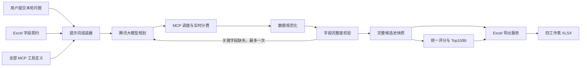

# KOL 最新轮次完整数据 Excel 导出设计

## 1. 背景与目标

系统当前在右侧 BI 报告顶部提供“导出 PDF”入口，但前端只持有最终 Top10 候选摘要，无法按照 `KOL匹配度分析报告.xlsx` 模板导出完整达人画像。

本需求需要完成两件相互依赖的工作：

1. 每轮会话分析时，大模型依据固定字段契约规划 MCP 工具调用，采集生成模板所需的达人、内容表现和粉丝画像数据。
2. 用户在右侧 BI 报告顶部点击“导出 Excel”时，导出当前会话最新一轮分析的全部候选数据，而不是只导出最终 Top10。

导出不重新调用大模型或 MCP，避免重复扣费。历史会话恢复后，只要最新轮次已有候选数据，仍可重新生成并下载 Excel。

## 2. 范围

### 2.1 本期包含

- 用“导出 Excel”替换右侧 BI 报告顶部现有“导出 PDF”按钮。
- 将版本化 Excel 字段契约加入每轮大模型规划上下文。
- 继续向大模型提供全部已启用的 MCP 工具定义，由模型结合用户问题、行业、平台、目标人群和其他筛选条件规划工具调用及参数。
- 对 MCP 结果执行确定性的字段完整度校验；关键字段缺失时允许一次自动重新规划。
- 保存每轮任务的完整规范化候选池，同时保留当前 Top10 候选和 BI 报告交付逻辑。
- 导出当前会话最新一轮的全部规范化候选。
- 多平台数据合并到同一排名表，并新增“平台”字段。
- 生成与参考模板一致的 4 个工作表及视觉风格。
- 动态适配行业、目标地区、目标年龄和平台指标口径。

### 2.2 本期不包含

- 合并同一会话的多个历史轮次。
- 导出原始 MCP 响应。
- 在导出时补采数据或再次调用大模型/MCP。
- 新建异步导出 Worker 或微服务。
- 用户自定义模板上传、字段编辑或评分权重编辑。
- 保留 PDF 导出入口。

## 3. 方案选择

采用“后端生成 Excel + 每轮分析预采集完整字段”的方案。

不采用前端直接生成，因为前端当前只拥有 Top10 摘要，将完整画像下发浏览器会扩大数据暴露面，也难以保证权限、格式和历史恢复一致性。

不采用异步导出 Worker，因为当前预期同时在线用户和任务均不超过 10，Python 模块化单体可以在请求中完成模板生成；后续如数据规模显著增长，导出服务可以沿既有边界迁移到 Worker。

## 4. 总体架构

设计边界如下：

- 大模型负责理解用户问题、选择工具、组织调用顺序和参数。
- 后端字段契约负责定义必须采集和导出的字段，不能由模型随意改变。
- 后端校验器负责判断字段是否完整，不能仅依赖模型自报完成。
- 规范化层负责统一小红书、抖音等平台的字段语义和单位。
- 评分服务产生唯一评分快照，页面、BI 和 Excel 共同使用该快照。
- 导出服务只读取数据库中的规范化数据，不接触 MCP 密钥或原始响应。

## 5. 每轮大模型与 MCP 数据流

### 5.1 字段契约

新增版本化 `ExcelExportFieldContract`，至少包含以下字段族：

- 基础身份：平台、达人名称、公开主页、城市、性别。
- 账号规模：粉丝数、互动沉淀总量及平台对应口径。
- 内容表现：内容标签、平均阅读/播放、平均互动、互动率。
- 粉丝年龄：18 岁以下、18–24 岁、25–34 岁、35–44 岁、44 岁以上。
- 粉丝地域：目标省市占比和主要地域分布。
- 粉丝质量：活跃粉丝率。
- 粉丝兴趣：与本轮行业匹配的兴趣占比及 Top 兴趣标签。
- 数据质量：字段状态、来源调用、采集时间和缺失原因。

字段契约带有版本号，并随任务计划和候选快照保存，保证历史任务可按当时口径恢复。

### 5.2 提示词组装

每轮提示词包含：

- 用户本轮问题和同会话必要上下文。
- 会话筛选条件：行业、平台、品牌、活动、目标人群、预算及达人名称等。
- 全部已启用 MCP 工具的名称、说明和参数 Schema。
- `ExcelExportFieldContract` 的字段、类型、单位、是否关键和平台适配说明。
- 约束：不得编造缺失数据；必须保留工具证据引用；多个平台均需执行检索；调用失败后可重新规划。

### 5.3 工具执行

模型先按所选平台检索候选，再按候选逐步补充基础信息、内容表现和粉丝画像。工具调度遵循现有计费规则：每个成功 MCP 工具函数响应扣 10 积分；失败不计费；重复调用分别计费；余额不足立即停止后续调用。

如果 MCP 服务对并行或限流有约束，调度器按服务配置进行受控并发，不让一个平台的失败阻断其他平台已成功的数据。

### 5.4 完整度校验与重新规划

规范化后，后端逐候选检查字段契约：

- 关键字段缺失且存在可用补采工具时，将“缺失字段名、字段类型、候选公开平台标识和可用工具摘要”交给模型重新规划一次。
- 不把达人原始响应、MCP 密钥、接口地址或敏感诊断信息放入重新规划上下文或日志。
- 重新规划后仍缺失的字段标记为“数据缺失”，本轮继续生成部分成功结果。
- 同一任务只允许一次字段补采重新规划，避免无限循环和不可控扣费。

## 6. 数据模型

### 6.1 完整候选池

新增任务级完整候选池存储，保持现有最终候选表的 Top10 语义不变。具体新增：

- `task_candidate_pools`
  - 任务、候选池版本、字段契约版本、候选总数、创建时间。
- `task_candidate_pool_items`
  - 任务候选池、KOL、平台、规范化快照、统一评分、全量排名、是否进入 Top10。
- 现有 `kol_snapshots`
  - 继续保存规范化画像快照和证据引用；扩展为能够承载 Excel 字段契约需要的数据。

一个任务候选池不可变。多轮会话产生新的任务和新的候选池，不覆盖前一轮。

### 6.2 字段状态

每个可选字段至少保留：

- `value`：规范化值。
- `status`：`valid`、`missing` 或 `not_applicable`。
- `source_call_id`：支持该字段的 MCP 调用引用。
- `collected_at`：采集时间。
- `missing_reason`：不含原始响应和敏感信息的缺失说明。

## 7. 统一评分

页面、BI 和 Excel 使用同一评分结果快照。默认总分 100，沿用参考模板的 8 个维度：

| 维度 | 满分 | 动态口径 |
|---|---:|---|
| 行业兴趣 | 20 | 根据本轮行业生成，如美妆兴趣、餐饮兴趣 |
| 目标地区粉丝 | 15 | 根据用户指定省市计算 |
| 目标年龄 | 15 | 根据用户指定年龄段聚合 |
| 互动率 | 15 | 使用平台规范化互动率 |
| 活跃粉丝 | 10 | 使用粉丝活跃度指标 |
| 内容标签 | 10 | 根据行业和用户问题判断标签匹配 |
| 粉丝规模 | 10 | 根据本轮粉丝要求和规模区间评分 |
| 互动沉淀与粉丝比 | 5 | 小红书采用赞藏口径；抖音采用可获得的获赞、评论、收藏等平台口径 |

具体阈值由评分规则版本管理，并在工作簿“评分方法论与数据来源”中明确展示。

原始值缺失时，数据单元格显示“数据缺失”。若评分规则按模板采用中间分，必须同时记录缺失状态，并在评分理由中写明“数据缺失，按规则取中间分”；不得把中间分表示成 MCP 实际返回值。

## 8. Excel 工作簿

工作簿保持参考模板的蓝色表头、交替行底色、评分颜色、中文字体、汇总区和图表风格。

### 8.1 KOL 匹配度筛选

- 合并标题和本轮报告元数据。
- 导出完整候选池，按统一综合评分降序排列。
- 在参考模板字段中新增“平台”列。
- 行业、地区和年龄字段名按本轮条件动态显示。
- 包含评分分布汇总和评级分布图。

字段顺序固定为：

1. 序号
2. 平台
3. 昵称
4. 评级（星级）
5. 粉丝数
6. 城市
7. 行业兴趣分
8. 目标地区粉丝分
9. 目标年龄分
10. 互动率分
11. 活跃粉丝分
12. 内容标签分
13. 粉丝规模分
14. 互动沉淀与粉丝比分
15. 综合评分
16. 匹配评估
17. 评分理由

### 8.2 达人详细画像

为完整候选池中的每位达人生成连续详情块，包含：达人概况、内容表现、粉丝画像、综合评估和中文综合概述。详情块显示平台和公开主页，但不显示内部 KOL ID。

### 8.3 粉丝画像详情

每位达人一行，至少包含：序号、平台、昵称、粉丝数、各年龄段占比、目标地区粉丝占比、活跃粉丝占比、行业兴趣占比和综合评分。

### 8.4 评分方法论与数据来源

动态写入：

- 本轮 8 个评分维度及公式。
- 评级映射。
- 小红书、抖音等平台指标口径。
- 数据来源服务名称和采集时间。
- 平台失败、字段缺失、中间分使用等非敏感说明。

不得写入 MCP 接口地址、访问令牌、原始响应、内部数据库 ID 或安全诊断信息。

## 9. API 与前端交互

### 9.1 导出接口

新增当前会话最新轮次导出接口：

`GET /api/v1/sessions/{session_id}/exports/latest.xlsx`

接口行为：

1. 校验当前用户拥有该会话。
2. 定位会话最新任务，不回退到更早的成功任务。
3. 最新任务仍在运行时返回业务冲突状态。
4. 最新任务成功或部分成功且存在候选池时生成工作簿。
5. 最新任务失败或候选池为空时返回明确业务错误，不生成空文件。
6. 使用流式文件响应，不长期保存重复生成的 Excel 文件。

文件名格式：`品牌_行业_KOL匹配度分析_yyyyMMdd_HHmm.xlsx`。文件名必须清理操作系统不安全字符。

### 9.2 前端按钮

- 将 BI 顶部“导出 PDF”替换为“导出 Excel”，保持现有按钮尺寸、颜色、圆角和图标风格。
- 分析进行中时禁用，提示“分析完成后可导出”。
- 最新任务有候选数据时启用。
- 点击后请求导出接口，根据响应头下载文件。
- 导出失败时在 BI 面板内显示中文错误提示，不跳转页面。
- 切换会话后，按钮始终绑定当前活动会话，不能沿用前一会话的任务或文件。

## 10. 异常与安全

- 单个平台失败：保留其他平台数据，任务可部分成功；工作簿注明缺失平台。
- 单字段失败：标记缺失，按规则处理评分；不阻断整份导出。
- 全部平台无候选：禁止导出空工作簿。
- 余额不足：停止 MCP 调用；已有规范化候选可以按部分成功策略保存和导出。
- 日志只记录字段名、字段类型、长度、状态和 Schema 校验路径，不记录达人原始数据、密钥或接口地址。
- 导出数据必须通过用户—会话归属校验，不能通过猜测任务或会话 ID 获取其他用户数据。
- Excel 不包含内部达人 ID、任务 ID、报告 ID、MCP 调用 ID、令牌或接口地址。

## 11. 测试与验收

### 11.1 后端

- 提示词组装测试：每轮均包含字段契约版本、全部 MCP 工具定义和本轮筛选条件。
- 规划测试：多平台问题生成覆盖所有选中平台的检索计划。
- 完整度测试：关键字段缺失时触发一次重新规划，第二次缺失后停止重试。
- 计费测试：成功调用扣 10 积分，失败不扣费，补采调用按实际成功次数扣费。
- 规范化测试：小红书和抖音指标映射到统一字段且保留平台口径。
- 数据库测试：完整候选池全部保存，Top10 标记和统一评分正确，多轮互不覆盖。
- 权限测试：用户只能导出自己的会话。
- 导出测试：4 个工作表存在，字段顺序正确，所有候选均导出，评分与 BI 一致。
- 安全测试：工作簿和日志不包含密钥、接口地址、原始响应和内部 ID。

### 11.2 前端

- 最新任务进行中时按钮禁用。
- 成功和部分成功且有候选数据时按钮可用。
- 点击后下载后端返回的 `.xlsx` 文件并采用服务端文件名。
- 切换会话后请求正确的当前会话 ID。
- 导出失败时显示中文错误。

### 11.3 工作簿视觉验收

- 对 4 个工作表分别渲染并检查。
- 表头、列宽、行高、换行、合并标题、颜色和数字格式与参考模板一致。
- 长评分理由和详情概述不被裁切。
- 百分比为数值型百分比，粉丝数和评分为数值，不写成不可排序的文本。
- 评级分布汇总与图表使用公式引用实际候选数据。
- 无公式错误、断裂引用或空白默认工作表。

## 12. 可扩展性

字段契约、规范化、完整度校验、评分和工作簿生成均作为模块化单体中的独立服务。未来任务量增长时，可以将“候选补采”和“Excel 文件生成”迁移到 Worker，而不改变前端接口、数据库快照语义和工作簿格式。

## 13. 完成标准

- 用户完成任意一轮多平台 KOL 分析后，系统保存该轮全部规范化候选，而不是只保存 Top10。
- 页面和 BI 继续展示统一排序的 Top10。
- 右侧顶部可以导出该会话最新一轮全部候选的 Excel。
- Excel 具备参考模板的 4 个工作表、字段、格式、评分汇总和中文说明，并新增平台字段。
- 大模型每轮均收到字段契约并按需规划 MCP；缺失关键字段最多自动补采一次。
- 导出不会再次调用 MCP、不会重复扣费，也不会泄露密钥、接口地址、内部 ID 或原始响应。
