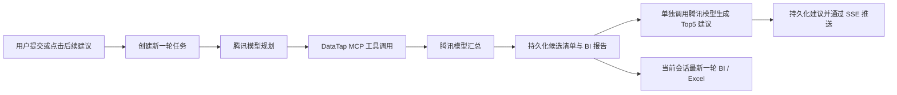

# 会话删除、BI 数据分析、AI 后续建议与 Excel 导出修复设计

## 1. 背景与目标

当前系统已经具备会话、任务执行、MCP 数据采集、AI 汇总、BI 报告及 Excel 导出主链路。本次改动解决四类问题：

1. 左侧会话缺少删除能力，且部分会话名称为空。
2. 右侧 BI 需要增加“数据分析”页，并且只能展示当前会话最新一轮任务的真实数据。
3. 会话完成后的常用指令需要改为由腾讯模型结合本轮结果生成的 Top5 后续分析建议，点击后可继续同一会话的下一轮分析。
4. Excel 导出在候选数据写入模板合并单元格时出现 `MergedCell` 只读异常。

本次设计保持现有异步流式模块化单体架构、前端原型视觉风格、真实腾讯模型和真实 DataTap MCP 调用。登录仍可保留开发期模拟，其余链路不引入 Fake 实现。

## 2. 范围与约束

### 2.1 本次范围

- 会话软删除、列表过滤、当前会话切换。
- 会话标题稳定显示及重命名规则修正。
- 右侧 BI 增加“BI 报告 / 数据分析”Tab。
- 最新一轮任务的数据分析指标展示。
- 每轮成功或带警告完成后单独调用腾讯模型生成 5 条后续建议。
- 建议持久化、SSE 推送和点击后启动同一会话下一轮任务。
- 修复 Excel 模板合并单元格写入错误。
- 用户可理解的错误提示和安全日志。

### 2.2 非目标

- 不实现跨轮累计 BI，也不合并历史任务数据。
- 不在 MCP 缺少指标时让模型补造数值。
- 不改变 MCP 计费规则。
- 不新增充值支付能力。
- 不重做整个页面布局，右侧 BI 保持现有约 420px 宽度和纵向滚动。

## 3. 总体数据流



Top5 建议采用独立模型调用。这样建议生成失败不会使已经完成的数据分析任务回滚，也能独立显示“正在生成建议”的阶段状态。

## 4. 后端设计

### 4.1 会话软删除

在会话模型增加可空字段 `deleted_at`，并提供数据库迁移。

所有面向用户的会话访问统一加入：

- `user_id` 必须属于当前用户；
- `deleted_at IS NULL`。

覆盖范围包括：

- 会话列表；
- 会话详情；
- 会话更新与重命名；
- 消息查询和追加；
- 新任务创建、重试和导出；
- BI 报告、候选清单等会话派生资源访问。

新增 `DELETE /api/v1/sessions/{session_id}`。接口在事务中锁定会话记录，校验归属后写入 `deleted_at`。重复删除返回幂等成功或不可见语义，不进行物理删除，历史任务、计费流水和审计关联继续保留。

### 4.2 会话名称规则

前端显示名称优先级：

1. `session.title`；
2. 品牌名称与活动/项目名称组合；
3. 行业名称 + “KOL 分析”；
4. “未命名会话”。

后端创建会话时也按相同语义生成默认标题。重命名不再要求活动/项目名称必填，避免与新建会话表单规则冲突。

### 4.3 最新一轮 BI 数据分析

右侧 BI 的数据源必须由“当前选中会话 ID + 该会话最新一轮可用任务”确定。不得用全局最后一次报告、前一会话的 React 状态或静态示例数据填充。

`BiReport.chart_data_json` 扩展为兼容旧数据的结构化分析字段：

- `overview`：品牌声量、曝光量、平均互动率；
- `sentiment`：正向、中立、负向比例及评论热词；
- `exposure_trend`：日期/阶段与曝光量序列；
- `audience.age`：年龄段占比；
- `audience.gender`：性别占比；
- `audience.regions`：地域 Top5；
- 现有候选评分、平台分布及匹配度数据继续保留。

这些字段只从本轮 MCP 返回的结构化数据和确定性聚合结果产生。字段缺失时写入 `null`、空数组或明确的 `available: false`，不调用模型编造指标。旧报告缺少新字段时，API 兼容返回空数据结构。

### 4.4 AI Top5 后续分析建议

触发条件仅为任务状态：

- `completed`；
- `completed_with_warnings`。

主汇总消息持久化完成后，后台使用单独的腾讯模型调用。输入包含：

- 当前用户问题；
- 当前会话筛选条件（行业、平台、品牌、目标人群、预算等已有字段）；
- 本轮使用的 MCP 工具名称及成功/失败概况；
- 本轮汇总结论、候选数量和可用 BI 指标摘要；
- 明确要求输出 5 条可以直接作为下一轮用户提问的专业中文建议。

输出使用严格 JSON Schema，例如：

```json
{
  "suggestions": [
    {"title": "分析建议标题", "prompt": "可直接执行的完整提问"}
  ]
}
```

规则：

- 必须恰好 5 条；
- 标题和提问均为中文；
- 不包含 MCP 工具名、内部 ID、密钥或接口地址；
- 建议应基于本轮已有信息，并允许提出需要下一轮 MCP 进一步验证的分析；
- 输出解析失败时允许一次格式纠正；再次失败则记录安全错误并返回空建议，不改变主任务完成状态。

建议持久化在本轮 AI 汇总消息的结构化元数据中，或使用与消息/任务关联的独立 JSON 字段。关键要求是刷新页面后仍可恢复，并能明确关联 `task_id` 和轮次。

建议生成状态通过任务事件/SSE 表达：

- `followup.suggestions_started`；
- `followup.suggestions_updated`；
- `followup.suggestions_failed`。

点击建议后，前端把该建议的完整 `prompt` 作为新的用户消息提交，在同一个 `session_id` 下创建新任务；行业、平台和其他会话筛选条件继续复用。新任务仍完整执行腾讯模型规划、真实 MCP、模型汇总和建议生成。

### 4.5 Excel 导出修复

根因是模板候选数据区域存在跨行或跨列合并，批量写入多名候选时命中 openpyxl 的只读 `MergedCell`。

修复策略：

1. 加载模板后识别候选数据起始行、结束行和输出列范围；
2. 仅解除与候选数据写入区域相交的合并范围；
3. 保留标题、说明、汇总等非候选区域的合并格式；
4. 再复制模板行样式并写入最新一轮全部候选；
5. 若候选数超过模板预留行数，继续扩展样式和必要公式；
6. 导出数据只读取当前会话最新一轮任务，并保留新增的平台字段。

导出失败时 API 返回稳定的中文错误码与说明，前端展示错误，不把堆栈暴露给用户。

## 5. 前端设计

### 5.1 左侧会话列表

- 会话行悬停时显示删除图标，图标沿用现有按钮和图标体系。
- 点击后显示二次确认，确认按钮进入短暂加载状态，阻止重复提交。
- 删除非当前会话：从列表移除，当前视图不变。
- 删除当前会话：优先选中最近访问的下一条会话；列表为空则进入新建/空白状态，同时清空消息、候选和 BI。
- 失败时恢复列表项并显示中文提示。
- 页面刷新后，软删除会话不会再出现。

### 5.2 右侧 BI Tab

右侧保持现有约 420px 固定宽度和纵向滚动，顶部增加两个 Tab：

- “BI 报告”：保留现有任务概览、评分构成、平台分布等内容；
- “数据分析”：按设计图风格展示最新一轮分析。

“数据分析”卡片顺序：

1. 三个核心指标卡：品牌声量、总曝光量、平均互动率；
2. 舆情情感极性分析：环图、三类比例条、热词标签；
3. 活动传播周期与曝光走势：折线/面积趋势图；
4. 粉丝客群/受众人口统计：年龄柱状图、性别比例、地域 Top5。

卡片外框、标题、图标、留白、圆角、阴影和紫色主色沿用现有原型。数据缺失时卡片仍完整保留，数值区显示“数据不足”或空态，不绘制伪造图形。

切换会话时，前端先清空上一会话 BI 状态，再根据新 `session_id` 加载最新报告。请求响应还需校验会话 ID，避免较慢的旧请求覆盖新会话。

### 5.3 AI 建议区

原固定“常用指令”替换为“AI 建议的进一步分析”。

- 本轮任务完成、建议尚未生成：显示“正在生成建议”骨架或加载状态；
- 生成成功：展示 5 个可点击建议；
- 点击：立即追加建议文本为用户消息并启动下一轮；
- 当前已有运行中任务时：按钮禁用，防止重复任务；
- 建议失败：显示“暂未生成进一步分析建议”，不把主任务标为失败；
- 切换会话或轮次：只显示该会话最新一轮对应的建议。

### 5.4 错误反馈

任务执行错误继续通过实际阶段事件在会话中显示。删除、建议和导出等局部错误使用现有 Toast/内联错误风格。用户可见内容为专业中文，不显示内部异常堆栈、数据库字段、模型密钥或服务地址。

## 6. 安全日志

失败诊断只记录：

- 错误类型和稳定错误码；
- 字段名、字段类型、集合长度；
- JSON Schema 校验路径；
- 会话/任务内部关联 ID（仅服务端日志使用）；
- MCP 工具名称和调用状态。

不得记录：

- 达人原始数据或完整 MCP 响应；
- 用户密钥、腾讯模型密钥、DataTap 令牌；
- 腾讯模型或 MCP 的完整接口地址；
- 包含敏感业务内容的完整 Prompt。

## 7. 数据一致性与并发

- 删除会话使用数据库事务与行锁，避免删除和新任务创建竞态。
- 创建任务前再次确认会话未删除。
- BI、建议和 Excel 均以显式 `session_id`、`task_id` 关联，不依赖全局缓存。
- SSE 事件携带 `session_id`、`task_id` 和事件序号，前端只接受当前会话/任务的事件。
- 建议点击复用当前会话配置，但每次创建独立任务和独立计费记录。

## 8. 测试与验收

### 8.1 后端测试

- 软删除后列表、详情、更新、任务创建和导出均不可访问该会话；其他用户不可删除。
- 重复删除行为稳定，历史任务和账务关联未物理删除。
- 默认标题与标题回退规则覆盖品牌、项目为空及只有行业的情况。
- 最新一轮报告查询不会返回其他会话或旧轮次数据。
- BI 新字段可由真实结构化输入确定性生成；字段缺失时返回空结构。
- 建议只在成功/带警告状态触发，严格解析 5 条中文建议；失败不改变主任务状态。
- 点击建议所对应的新任务复用会话筛选条件并形成新轮次。
- Excel 模板候选区包含合并单元格时仍能导出；候选数超过默认预留行数时仍成功；标题和汇总合并不被破坏。

### 8.2 前端测试

- 删除按钮、确认、失败恢复、删除当前会话后的自动切换。
- 刷新后被删除会话不再出现。
- 会话名称始终有可见回退值，活动/项目为空仍可重命名。
- BI Tab 切换和所有固定卡片的空数据状态。
- 快速切换会话时旧请求不会覆盖新会话 BI。
- 建议加载、成功、失败、禁用和点击发起下一轮。
- Excel 导出成功下载；失败时显示中文错误。

### 8.3 端到端验收

使用真实模型与真实 MCP 创建会话并完成至少两轮：

1. 第一轮完成后右侧展示本会话最新 BI，底部出现 5 条建议；
2. 点击建议启动同一会话第二轮，并出现真实任务阶段事件；
3. 第二轮完成后 BI 和建议切换到第二轮，不混入第一轮或其他会话；
4. 导出最新一轮 Excel，字段、平台列、格式和候选行正确；
5. 删除会话并刷新，记录不再出现。

## 9. 完成标准

- 四项需求全部在真实链路中可用。
- 不存在跨会话 BI、建议或导出数据串用。
- 空数据不伪造，卡片布局保持完整。
- Excel 不再因 `MergedCell` 写入报错。
- 自动化测试通过，并完成浏览器视觉与交互验证。

