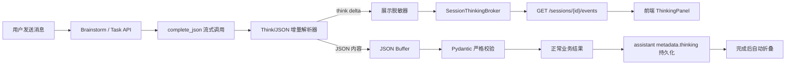

# 模型思考流式展示与结构化 JSON 容错设计

## 1. 背景

当前 `TencentPlanAdapter.complete_json` 使用非流式 OpenAI 兼容接口获取完整文本，并直接调用
`output_model.model_validate_json(content, strict=True)`。当供应商返回：

```text
<think>模型思考内容</think>
{"action":"execute"}
```

后面的 JSON 即使完全合法，整个字符串也会因为包含 `<think>` 而触发
`MODEL_PLAN_INVALID`。MiniMax-M3 的真实日志已经出现该问题。

同时，用户希望在会话中实时看到与当前请求直接相关的模型思考过程，并在模型调用完成后自动折叠；
刷新页面后仍能查看已完成或中断的思考内容。

## 2. 目标

1. 结构化模型响应包含 `<think>` 时，只把 JSON 部分交给 Pydantic 严格校验。
2. 支持模型正文中的 `<think>...</think>` 和供应商独立的
   `reasoning_content` 增量字段。
3. 将允许范围内的思考内容脱敏后实时发送到当前会话。
4. 运行中默认展开，完成或失败后自动折叠。
5. 将最终脱敏内容持久化到对应 assistant 消息，刷新后可以恢复。
6. 思考事件、脱敏或持久化失败不能影响分析任务及正式业务结果。
7. 不改变现有任务 SSE 的职责与事件契约。

## 3. 非目标

1. 不向用户展示所有模型调用的内部思考。
2. 不展示 `goal_summary`、followup、成功案例检索等后台辅助调用。
3. 不把原始思考文本混入正式 assistant 回答正文。
4. 不逐条持久化流式 delta。
5. 不因为 JSON 提取器而放宽现有 Pydantic Schema。
6. 不替换现有 `model_prompt_logs` 的管理员排障日志机制。

## 4. 展示范围

只有当前用户操作直接触发、且显式传入 `ThinkingSink` 的调用可以发布思考内容：

- `brainstorm`
- `goal_planner`
- `agent_loop`
- `brand_analysis`
- `campaign_analysis`
- `kol_analysis`

其他 `complete_json` 调用不传 `ThinkingSink`，即使供应商返回思考内容也只参与后端解析，
不向前端发布。

## 5. 总体架构

采用独立的会话级思考事件流，现有任务事件流保持不变。



职责边界：

- 会话 SSE：只负责 `thinking.*` 事件。
- 任务 SSE：继续负责任务状态、Goal、工具调用、积分和 Artifact 事件。
- 模型适配器：读取供应商流、分离思考与 JSON、保持结构化校验。
- `ThinkingSink`：接收模型适配器产生的生命周期事件，不依赖 FastAPI 或数据库。
- 会话思考服务：脱敏、广播、维护运行中快照并完成最终持久化。
- 前端 `ThinkingPanel`：按 `operation_id` 展示增量，并从消息 metadata 恢复历史内容。

## 6. 模型适配层

### 6.1 接口

`StructuredModelRequest` 增加不可比较的可选运行时字段：

```python
thinking_sink: ThinkingSink | None = field(default=None, compare=False)
```

`ThinkingSink` 提供以下异步方法：

```python
class ThinkingSink(Protocol):
    async def started(self, metadata: ThinkingMetadata) -> None: ...
    async def delta(self, text: str, *, attempt: int) -> None: ...
    async def completed(self, *, attempt: int, duration_ms: int) -> None: ...
    async def failed(self, *, attempt: int, error_code: str) -> None: ...
```

模型适配器只依赖该协议。Sink 抛出的异常必须被捕获并记录 warning，不能中断模型调用。

### 6.2 流式调用

`complete_json` 优先使用供应商的 `stream=True`：

1. 逐 chunk 读取 `delta.reasoning_content` 和 `delta.content`。
2. `reasoning_content` 直接作为思考增量。
3. `content` 交给支持跨 chunk 标签识别的增量状态机。
4. `<think>` 内文本发送给 Sink。
5. `<think>` 外文本只缓冲到 JSON 候选区，不发送到前端。
6. 流结束后提取 JSON 并执行 Pydantic 校验。

如供应商明确不支持流式结构化输出，则对该
`(base_url, model)` 缓存能力结论，并退回现有非流式调用。

### 6.3 增量状态机

状态机至少包含：

- `outside_think`
- `opening_tag_candidate`
- `inside_think`
- `closing_tag_candidate`

必须正确处理标签被任意拆分的情况，例如：

```text
<th
ink>正在
分析</thi
nk>{"action":"execute"}
```

未闭合 `<think>`：

- 流结束前按思考内容处理。
- JSON 区为空时仍进入原有修复重试。
- 最终持久化状态由模型调用结果决定。

### 6.4 JSON 提取

流式与非流式路径共用同一个纯函数提取器：

1. 移除所有 `<think>...</think>` 块。
2. 移除包裹 JSON 的 Markdown fence。
3. 使用感知字符串转义和嵌套深度的扫描器，提取第一个完整 JSON 对象。
4. JSON 对象外的解释文本不参与校验。
5. 如果存在第二个独立 JSON 对象或第一个对象不完整，视为无效输出。
6. 对提取结果调用 `output_model.model_validate_json(..., strict=True)`。

因此只容忍“输出包装噪声”，不容忍字段缺失、类型错误、额外字段或多份冲突结果。

### 6.5 自动修复

保留当前最多两次生成：

- 第一次解析失败后附加修复指令。
- 第二次仍失败时抛出 `MODEL_PLAN_INVALID`。
- 两次生成共用同一个 `operation_id`。
- 事件中携带 `attempt=1|2`。
- 第二次开始时前端显示“正在修正输出格式”。
- 两次思考分别保存为独立 block，不合并原文。

## 7. 会话级思考事件

### 7.1 端点

新增：

```http
GET /api/v1/sessions/{session_id}/events
Accept: text/event-stream
Last-Event-ID: <optional>
```

鉴权和会话归属检查沿用现有 API；前端复用 `authorizedFetch` 与
`parseSseStream`，不使用浏览器原生 `EventSource`，避免丢失访问令牌刷新能力。

同一前端会话页只维持一个会话 SSE 连接。切换会话时必须取消旧连接。

### 7.2 事件

事件类型：

- `thinking.started`
- `thinking.delta`
- `thinking.snapshot`
- `thinking.completed`
- `thinking.failed`

公共载荷：

```json
{
  "operation_id": "uuid",
  "turn_id": "会话轮次UUID",
  "session_id": "uuid",
  "purpose": "brainstorm",
  "task_id": null,
  "goal_id": null,
  "attempt": 1,
  "label": "正在理解需求",
  "sequence": 1
}
```

`thinking.delta` 额外携带 `text`；`thinking.snapshot` 携带当前完整脱敏文本和状态；
终态事件携带 `duration_ms`、`status` 和可选 `error_code`。

### 7.3 Broker 与断线

`SessionThinkingBroker` 以内存队列广播事件，并按
`session_id + operation_id + attempt` 保存当前运行快照：

- 新订阅者先收到所有运行中 operation 的 `thinking.snapshot`。
- 随后继续接收 delta。
- operation 完成后从运行快照移除。
- 已完成内容以 assistant 消息 metadata 为权威来源。

不把每个 delta 写入数据库。后端进程在调用中途重启时，未完成的快照可能丢失；任务恢复后产生新的
operation。已经完成并持久化的内容不受影响。

### 7.4 慢消费者

每个订阅者队列设置上限。队列满时不阻塞模型调用：

- 丢弃该订阅者尚未消费的旧 delta。
- 发送最新 `thinking.snapshot`。
- 继续正常广播后续事件。

## 8. 消息归属与持久化

### 8.1 Turn

一条用户提交对应一个独立的 `turn_id`。它不能直接使用数据库 message ID，因为 GoalPlanner 当前在
`TaskService.create` 写入用户消息之前执行。

- 前端提交 Brainstorm 或 Task 时生成 UUID，并通过请求字段 `turn_id` 传入。
- 后端校验 UUID；旧客户端没有传入时由后端生成，保持向后兼容。
- `turn_id` 写入该轮用户消息和 assistant 消息的 metadata。
- GoalPlanner 在用户消息落库前即可使用请求中的 `turn_id` 发布事件。
- 前端用 `turn_id` 将临时思考面板放在当前乐观用户消息之后；服务端消息返回后再以 metadata 对齐。

同一轮产生的多个直接模型调用最终归属该轮的 assistant 消息。

- Brainstorm：归属澄清或信息确认 assistant 消息。
- GoalPlanner `clarify`：归属 planner 澄清消息。
- GoalPlanner `execute`、Agent Loop、报告生成：归属任务最终结论或错误消息。

### 8.2 Metadata 契约

在现有消息 metadata 白名单中增加：

```json
{
  "thinking": {
    "version": 1,
    "status": "completed",
    "blocks": [
      {
        "operation_id": "uuid",
        "purpose": "agent_loop",
        "attempt": 1,
        "label": "正在分析数据",
        "content": "脱敏后的思考内容",
        "status": "completed",
        "started_at": "ISO-8601",
        "completed_at": "ISO-8601",
        "duration_ms": 21808,
        "truncated": false
      }
    ]
  }
}
```

顶层状态：

- 全部完成：`completed`
- 任一中断且没有仍运行 block：`interrupted`
- 仍有运行 block：`running`

只持久化脱敏后的文本，不持久化原始文本。

### 8.3 失败持久化

已输出的思考不能因为主业务事务回滚而丢失：

- Brainstorm 或 Planner 在正式 assistant 消息创建前失败：使用独立短事务落一条错误 assistant 消息，
  并附带 `thinking.status=interrupted`。
- 任务失败：附加到已有任务错误消息。
- 思考 metadata 写入失败只记录 warning，不把原任务改为失败。

消息更新必须带用户与会话归属条件，并使用幂等的
`operation_id + attempt` 合并，防止恢复或重复回调产生重复 block。

### 8.4 请求契约兼容

`BrainstormRequest` 和 `TaskCreate` 增加可选 `turn_id: UUID`。前端类型同步增加该字段。

- 新客户端总是发送。
- 旧客户端省略时后端生成。
- `turn_id` 不参与业务意图识别，也不写入模型 prompt。
- 幂等请求重复提交时沿用首次任务及消息中的 `turn_id`，不能创建第二套思考面板。

## 9. 展示脱敏

只有发送给普通用户和写入 assistant metadata 的副本执行展示脱敏。既有
`model_prompt_logs` 继续保留供应商原始响应供管理员排障。

脱敏规则：

1. API Key、Bearer Token、JWT、常见 token/key 形态替换为 `[已隐藏]`。
2. 完整系统提示词替换为 `[系统指令已隐藏]`。
3. 完整 JSON Schema 替换为 `[输出结构说明已隐藏]`。
4. 单个 block 最多 12,000 字符。
5. 同一 turn 全部 blocks 最多 30,000 字符。
6. 超出时设置 `truncated=true`，末尾添加“思考内容过长，已截断”。

前端使用纯文本和 `white-space: pre-wrap` 渲染，不把思考内容解释为 HTML。

## 10. 前端交互

新增 `useSessionThinkingStream(sessionId)` 和 `ThinkingPanel`。

### 10.1 运行中

- 面板位于对应用户消息之后、正式 assistant 回答之前。
- 默认展开并实时追加文本。
- 标题根据 purpose 显示：
  - Brainstorm：正在理解需求
  - GoalPlanner：正在规划分析目标
  - Agent Loop：正在分析数据
  - 报告构建：正在生成品牌/活动/KOL报告
- 第二次生成显示“正在修正输出格式”。
- 用户位于会话底部时自动跟随；用户主动向上滚动后不强制回到底部。

### 10.2 完成

- 收到终态事件后自动折叠。
- 标题显示“已思考 21.8 秒”。
- 点击可以展开。
- 多个模型调用汇总为一个面板，内部按阶段和 attempt 分组。
- 刷新后从 assistant `metadata.thinking.blocks` 恢复。

### 10.3 失败

- 自动折叠并显示“思考中断”。
- 展开后可以查看失败前的脱敏内容。
- 正式错误消息仍按现有机制展示。
- 模型没有返回思考内容时不渲染空面板。

### 10.4 状态合并

前端以 `operation_id + attempt` 为 block 主键：

- `started` 创建空 block。
- `delta` 追加到运行 block。
- `snapshot` 覆盖运行 block 的当前文本，用于重连恢复。
- `completed/failed` 写入终态并触发自动折叠。
- assistant 消息 metadata 到达后替换同一 operation 的临时状态，避免重复面板。

## 11. 降级与错误隔离

1. 供应商不支持流式结构化输出时退回非流式调用。
2. 非流式响应仍使用 think/JSON 提取器。
3. 降级模式在请求完成后一次性发布完整思考内容。
4. Session SSE 断开不影响模型调用。
5. Broker、Sink、脱敏和 metadata 写入异常只记录 warning。
6. JSON 业务校验失败仍按现有规则修复一次并最终抛错。
7. 没有 `ThinkingSink` 的调用不创建会话事件或消息 metadata。

## 12. 测试策略

### 12.1 后端单元测试

- 纯 JSON。
- 完整 `<think>` + JSON。
- 开闭标签在任意 chunk 边界拆分。
- `reasoning_content`。
- Markdown fence。
- JSON 字符串转义、嵌套对象与数组。
- 多段 think。
- 未闭合 think。
- 截断 JSON。
- 多个独立 JSON 对象应拒绝。
- 自动修复两次及 attempt 事件。
- 流式不支持时的非流式降级。
- Sink 异常不影响模型结果。

### 12.2 脱敏测试

- API Key、Bearer、JWT。
- 系统提示词和完整 Schema。
- 单 block 和单 turn 长度上限。
- 原始日志与用户展示副本相互独立。

### 12.3 会话事件测试

- 用户和会话数据隔离。
- 同会话订阅与跨会话隔离。
- snapshot 重连。
- 慢消费者队列压缩。
- completed/failed 清理运行快照。
- 不持久化 delta。

### 12.4 业务集成测试

- Brainstorm 成功与失败。
- GoalPlanner clarify 与 execute。
- 单 Goal 和多 Goal Agent Loop。
- 品牌、活动与 KOL 报告。
- 不允许范围内的后台调用不产生事件。
- assistant metadata 的幂等合并。

### 12.5 前端测试

- 实时增量追加。
- snapshot 覆盖与继续追加。
- 完成自动折叠。
- 失败折叠。
- 刷新后 metadata 恢复。
- 会话切换取消旧连接。
- 无 think 不渲染。
- 用户向上滚动时不强制滚动。
- 纯文本渲染不执行 HTML。

## 13. 验收标准

1. MiniMax-M3 返回 `<think>...</think>` 后跟合法 JSON 时，业务请求成功，不再产生
   `MODEL_PLAN_INVALID`。
2. Brainstorm、GoalPlanner、Agent Loop 和三类报告中返回的思考内容可以实时显示。
3. 后台辅助模型调用不会出现在用户会话。
4. 思考完成或失败后自动折叠，刷新后仍能查看。
5. 展示内容经过脱敏并受长度限制。
6. 思考链路任意异常不影响正式分析结果。
7. 原有任务 SSE、消息正文、Goal/Artifact 和积分行为保持兼容。
8. 后端、前端及新增测试全部通过。
