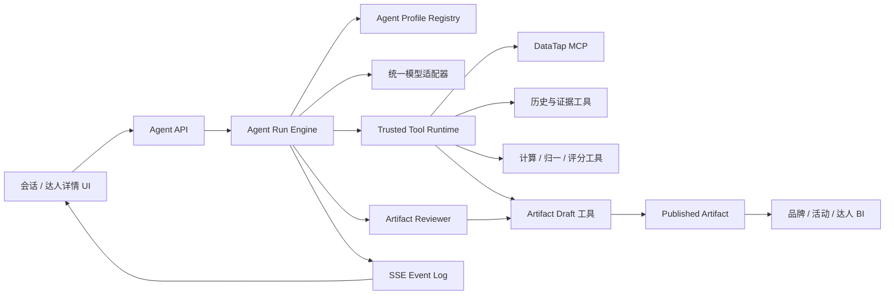
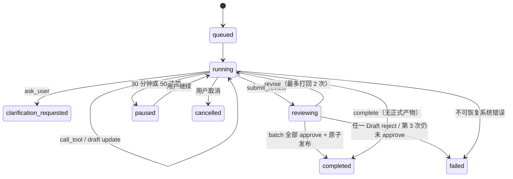

# 模型主导的统一 Agent 运行时设计

状态：已确认，待用户最终书面复核
日期：2026-08-02  
适用范围：所有使用模型的用户功能、MCP 调用、分析产物与前端执行状态

## 一、背景

当前系统把模型能力拆散在 Brainstorm、GoalPlanner、GoalPolicy、Agent Loop、快捷功能小循环、报告叙事、KOL 分析、摘要、追问建议和上下文答疑等多条链路中。业务步骤有一部分写在 prompt，一部分由代码通过 goal 类型、阶段清单、证据缺口和专用端点控制。

真实品牌分析暴露出当前边界的问题：模型名义上自主规划，但仍需理解大量工程规则；代码又没有把关键业务约束落实为可靠状态，只把 `evidence_gaps` 等提示交给模型。单个重型 MCP 查询失败还可能触发服务级熔断，阻断其他无关维度。

本设计将系统重建为“模型主导 + 可信执行内核”：模型决定业务分析流程，代码仅负责能力边界、安全、计费、状态、证据、结构校验和表现层。

## 二、已确认决策

| 主题 | 决策 |
|---|---|
| 切换方式 | 一次性替换所有模型功能，不保留旧执行路径 |
| 代码迁移 | 全量重建新 API、新 Agent 数据模型和前端执行状态 |
| 历史数据 | 仅保留账号、积分账本和收藏；旧会话、任务、报告不迁移且不展示 |
| Artifact | 核心产物强类型；开放式钻取使用通用 Artifact |
| 模型组织 | 统一运行时 + 多 Agent Profile；Profile 限定能力，不规定业务步骤 |
| 会话入口 | 合并 Brainstorm、GoalPlanner 和执行 Agent 为 Session Agent |
| 质量复核 | 正式产物由独立 Reviewer 复核，最多打回两次 |
| 积分 | 不设单 Run 上限，只受钱包可用余额限制 |
| 会话记忆 | 最近消息 + 摘要 + Artifact 目录；原始历史按需通过工具读取 |
| MCP 故障 | 同工具、同参数指纹细粒度熔断；未确认调用禁止自动重放 |
| 模型 | 所有 Profile 使用同一配置模型 |
| 运行保护 | 最长 30 分钟或 50 次模型决策，触发后暂停而非失败 |
| Artifact 发布 | Draft 可持续更新；Reviewer 通过后发布不可变版本 |
| BI 导航 | 固定“品牌分析 / 活动分析 / 达人”三个一级 Tab |
| 达人子 Tab | 继续保留“KOL 分析 / 圈选达人” |
| 快捷功能 | 删除达人推荐、活动评估、小红书爆贴、抖音爆贴独立页面与 API |
| 达人详情 | 保留，迁移至统一运行时和缓存机制 |
| 思考展示 | 主 Agent 思考流实时展示并在完成后折叠；Reviewer 仅展示状态 |

## 三、目标与非目标

### 3.1 目标

1. 每条用户消息创建一个独立、可恢复、可审计的 Agent Run。
2. Session Agent 自主完成澄清、答疑、工具选择、失败处理、钻取和产物生成。
3. 所有模型能力复用同一个决策循环、工具协议、事件协议和调用日志。
4. 所有 MCP 调用具备用户隔离、白名单、参数校验、幂等、计费和精确故障状态。
5. 所有正式数值产物可追溯到当前用户会话内的 Evidence。
6. 多轮钻取复用既有 Artifact 和 Evidence，不向模型全量注入历史数据。
7. 前端只消费统一 Run 事件和 Artifact，不根据具体业务流程拼装执行状态。

### 3.2 非目标

1. 不保留旧 Session、Task、Goal、Report 的执行兼容路径。
2. 不迁移旧会话、旧任务、旧报告和旧 Artifact 到新数据模型。
3. 不为模型规定品牌、活动或达人分析的固定工具顺序。
4. 不保留四个快捷功能的独立页面、API 或缓存。
5. 首次上线不物理删除旧表；旧表停止读取并隐藏，稳定后另行批准清理。
6. 不允许模型直接持有数据库连接、DataTap 密钥或绕过计费网关。

## 四、总体架构



### 4.1 模型拥有的业务控制权

- 判断当前输入是澄清回答、普通答疑、首次分析还是继续钻取；
- 决定是否需要询问用户；
- 选择工具、参数和调用顺序；
- 读取哪些历史 Artifact 或 Evidence；
- 工具失败后决定修正参数、切换工具、继续其他维度或结束；
- 创建、更新和提交哪些 Artifact；
- 决定何时信息足够并结束 Run。

### 4.2 代码保留的可信边界

- 用户身份、数据隔离、工具授权和密钥安全；
- 模型动作与工具参数 Schema 校验；
- MCP 调用幂等、计费、故障分类和恢复；
- Run 状态、Step、Evidence、事件和 Artifact 持久化；
- 运行时长和模型决策次数保护；
- Artifact 类型校验、Evidence 引用归属校验和版本不可变性；
- 前端展示、Excel 导出和文件下载。

代码不得再维护按业务维度定义的固定阶段清单、固定调用顺序或 GoalPolicy 工具流程。

## 五、Agent Profile

所有 Profile 使用同一配置模型、同一 OpenAI 兼容适配器、同一日志与错误契约。

| Profile | 入口 | 工具权限 | 输出 |
|---|---|---|---|
| `session_analyst_v1` | 所有普通会话消息 | 已审核 MCP、历史、计算、Artifact Draft | `ask_user`、`complete`、工具调用、正式或通用 Artifact |
| `artifact_reviewer_v1` | 正式 Artifact 提交复核 | 只读 Artifact 和 Evidence，不允许 MCP | `approve`、`revise`、`reject` |
| `kol_detail_v1` | 点击圈选达人 | KOL 详情、原帖、只读缓存、Artifact Draft | `kol_detail_v2` |
| `utility_v1` | 标题、Run 摘要、建议等后台轻量任务 | 不允许 MCP，只读短上下文 | 对应强类型 Utility 输出 |

Profile 注册项包含：名称、版本、system prompt、允许工具集合、允许动作、输出 Schema、是否要求 Reviewer、最大上下文预算。Profile 不包含业务调用顺序。

现有 13 类 `ModelPurpose` 收敛为 `session_agent`、`artifact_reviewer`、`kol_detail_agent`、`utility` 四类审计用途。

## 六、统一模型动作协议

每次模型决策必须输出一个受 Pydantic 严格校验的动作：

```text
ask_user
  question
  options[]             # 可空；有选项时 2-4 项

call_tool
  internal_tool_name
  arguments
  rationale

submit_review
  artifact_draft_ids[]   # 本 Run 待发布的全部正式 Draft，非空且去重
  completion_text       # Reviewer 通过后写入 assistant 消息
  summary

complete
  text
  suggestions[]         # 可选
```

Artifact 创建、更新、历史读取和计算统一作为受控内部工具通过 `call_tool` 执行，避免在顶层动作中持续增加业务特例。

模型输出 `ask_user` 时，本 Run 以 `clarification_requested` 结果完成；用户回答创建新 Run，并通过 `parent_run_id` 和待回答 Memory 关联。模型输出 `complete` 且没有正式 Artifact 时不触发 Reviewer。正式 Artifact 的用户回复由 `submit_review.completion_text` 暂存，只有本次提交批次中的全部 Artifact 都经 Reviewer 通过并原子发布后才写入 assistant 消息。

一个 Run 可以创建多个 Draft，但只能提交一个包含全部待发布 Draft 的 review batch。Review 以 Artifact 为单位记录结果，发布以 batch 为单位保持原子性：任何 Draft 尚未 approve 时，所有 Draft 都不发布；任一 Draft 最终 reject 时，整个 batch 失败且不产生部分发布。已 approve 的 Draft revision 可在后续 batch review 中复用；只有被修改或曾被 revise 的 Draft 重新审核。主 Agent 可将无法形成完整结果的模块改写为诚实披露限制的 `restricted` Draft，再由 Reviewer 决定是否 approve。

## 七、Run 状态机



每条新用户消息创建独立 Run。只有用户点击“继续”恢复 `paused` Run 时才复用原 Run；普通多轮消息绝不复用已完成 Run 的执行卡。

30 分钟/50 决策保护按 **Run Attempt** 计算，不按整个 Run 累计。首次启动和每次用户主动恢复都会创建新的 `agent_run_attempts` 行，并将该 Attempt 的 `started_at` 与 `decision_count` 从零开始；`agent_runs.decision_count` 保留跨 Attempt 累计值用于审计。一个 Attempt 达到任一阈值时结束为 `paused`，不会在恢复后立即再次触发。恢复次数不设额外上限，但每次恢复必须由用户显式触发。

每次模型决策前持久化上下文游标；每次工具调用在外发前持久化 Step 和 `logical_call_id`。恢复时从最后一个完整 Step 继续，禁止凭内存状态重建调用。

## 八、数据模型

### 8.1 新表

#### `agent_sessions`

- `id`, `user_id`, `title`, `status`；
- `session_summary`, `summary_version`；
- `created_at`, `updated_at`, `archived_at`；
- 所有查询必须带 `user_id` 与未归档条件。

#### `agent_messages`

- `id`, `session_id`, `run_id nullable`, `role`, `content`；
- `metadata_json`, `sequence`, `created_at`；
- 唯一 `(session_id, sequence)`。

#### `agent_runs`

- `id`, `session_id`, `user_id`, `input_message_id nullable`, `parent_run_id nullable`；
- `run_kind`: `user/internal`, `visibility`: `user/internal`；
- `profile_name`, `profile_version`, `model`, `prompt_snapshot_json`；
- `status`, `outcome`, `decision_count`, `review_count`, `revision_count`；
- `started_at`, `paused_at`, `completed_at`, `error_code`；
- 租约字段：`lease_owner`, `lease_expires_at`, `heartbeat_at`。

#### `agent_run_attempts`

- `id`, `run_id`, `attempt`, `started_at`, `ended_at`；
- `decision_count`, `outcome`: `running/paused/completed/failed/cancelled`；
- 唯一 `(run_id, attempt)`；首次执行为 1，每次用户恢复递增；
- 30 分钟/50 决策阈值只读取当前 Attempt。

#### `agent_steps`

- `id`, `run_id`, `attempt_id`, `sequence`, `step_type`；
- `input_json`, `output_json`, `status`, `duration_ms`；
- `thinking_text nullable`, `visibility`: `user/internal`；
- `model_request_id`, `token_usage_json`, `created_at`；
- 唯一 `(run_id, sequence)`。

Reviewer 与 Utility 不借用父 Run 的 Profile。每次 Reviewer 调用创建一个 `run_kind=internal`、`visibility=internal` 的子 `agent_runs`，Profile 为 `artifact_reviewer_v1`，`parent_run_id` 指向用户 Run；每个 Utility 任务同样创建 `utility_v1` 内部 Run。它们各自保存 Profile、Prompt 快照、模型、Step 和 token 用量，但不出现在用户执行卡中，也不计入父 Run 的 Attempt 决策阈值。父 Run 只追加 review/utility 结果引用。KOL Detail 是用户可见轻量 Run，使用 `kol_detail_v1` Profile。

#### `agent_tool_calls`

- `id`, `run_id`, `step_id`, `logical_call_id`；
- `service`, `internal_tool_name`, `arguments_json`, `arguments_hash`；
- `status`: `planned/reserved/running/settled/failed/unknown`；
- `points_reserved`, `points_settled`, `upstream_request_id`；
- `error_type`, `safe_error_message`, `started_at`, `completed_at`；
- `logical_call_id` 全局唯一。

#### `evidence_items`

- `id`, `session_id`, `run_id`, `tool_call_id`；
- `source_type`, `source_name`, `scope_json`, `period_json`；
- `raw_payload_json`, `normalized_preview_json`, `payload_hash`；
- `collected_at`, `availability_status`；
- Evidence 不可变，模型只能通过只读工具获取。

#### `artifact_drafts`

- `id`, `artifact_id`, `session_id`, `owner_run_id nullable`；
- `current_revision`, `status`: `idle/drafting/reviewing/failed`；
- `review_count`, `revision_count`, `updated_at`；
- `artifact_id` 唯一；它是每个稳定 Artifact 的长期工作头，不在发布后删除或归档；
- 新 Run 要更新同一 Artifact 时锁定该行，将 `owner_run_id` 切换到新 Run 并继续递增 revision；若仍由另一个活动 Run 持有，返回结构化 `artifact_busy`，不得覆盖。

#### `artifact_draft_revisions`

- `id`, `draft_id`, `artifact_id`, `run_id`, `revision`；
- `schema_version`, `payload_json`, `evidence_refs_json`, `parent_artifact_version_id nullable`；
- `payload_hash`, `created_at`；唯一 `(draft_id, revision)`；
- 每次 Draft 更新都先插入不可变 Revision，再以乐观锁推进 `artifact_drafts.current_revision`；Reviewer、发布和审计一律引用 Revision ID，不引用可变工作头内容。

#### `artifact_review_batches` / `artifact_review_items`

- Batch：`id`, `parent_run_id`, `status`, `completion_text`, `created_at`, `completed_at`；一个用户 Run 最多一条 Batch；
- Item：`id`, `batch_id`, `artifact_id`, `draft_revision_id`, `status`；唯一 `(batch_id, artifact_id)`；
- 每个 Item 的审核上限独立计算，Batch/父 Run 的 `review_count`、`revision_count` 仅做汇总审计；
- Draft 修改后，Item 改绑新 Revision，先前对旧 Revision 的 approve 自动失效；未修改且已 approve 的 Revision 可以在下一轮复核中复用；
- 发布事务锁定 Batch、全部 Item、Draft 和 Artifact，确认所有 Item 都是当前 Revision 的 approve 后，一次性插入全部 Version 并提交；任一校验失败则整批回滚。

#### `artifact_review_attempts`

- `id`, `review_item_id`, `attempt`, `draft_revision_id`, `review_run_id`；
- `decision`: `approve/revise/reject`, `issues_json`, `created_at`；
- 唯一 `(review_item_id, attempt)`；每次 Reviewer 调用插入一条不可变记录，完整保留最多三次复核的 Profile、Prompt、Step、输入 Revision 和结果关系；
- `artifact_review_items.status` 只是当前聚合状态，不代替 Attempt 历史。

#### `agent_artifacts`

- `id`, `session_id`, `user_id`, `module`, `artifact_type`；
- `parent_artifact_id nullable`；
- `artifact_key`, `status`: `draft/reviewing/published/failed`, `latest_version`, `activity_sequence`；
- `created_at`, `updated_at`；
- 创建 Draft 时先创建稳定 Artifact 身份，再创建引用它的 `artifact_drafts`；不直接在稳定身份行保存报告内容；
- 子 Artifact 在稳定身份上只记录父 Artifact；本次分析实际绑定的父 Version 保存在 Draft Revision 和发布 Version 上，避免更新稳定行改变历史语义。

`artifact_key` 在 Session 内唯一，数据库约束为 `(session_id, artifact_key)`：

- 品牌：`brand:{normalized_brand}`；
- 活动：`campaign:{normalized_brand}:{normalized_campaign}`；
- 圈选名单：`kol-selection:{normalized_scope_hash}`；
- KOL 分析：`kol-analysis:{selection_artifact_id}`；
- 达人详情：`kol-detail:{platform}:{kol_uid}`；
- 钻取：`insight:{parent_artifact_version_id}:{normalized_question_hash}`。

标准化使用 NFKC、trim、连续空白折叠和小写英文；hash 使用 SHA-256。模型提供业务字段，服务端生成 key，模型不能直接指定数据库 key。

#### `agent_artifact_versions`

- `id`, `artifact_id`, `version`, `source_run_id`, `source_draft_revision_id`；
- `parent_artifact_version_id nullable`；
- `schema_version`, `payload_json`, `evidence_refs_json`；
- `review_json`, `data_status`, `created_at`；
- 唯一 `(artifact_id, version)`；发布后不可更新。

发布事务必须原子执行：锁定 Artifact 与 Draft Revision，插入不可变 Version（复制 Revision 的 `parent_artifact_version_id`），更新 `agent_artifacts.latest_version/status`，将 Draft 工作头置回 `idle` 并释放 `owner_run_id`，再追加 `artifact.published` 事件。Draft Revision 和 Review Attempt 永久保留用于审计。Draft 事件始终使用稳定 `artifact_id`，因此前端从生成中到正式版本无需更换身份。

#### `artifact_events`

- `id`, `session_id`, `user_id`, `sequence`, `module`, `artifact_id`；
- `event_type`: `draft_created/draft_updated/reviewing/published/failed`；
- `draft_revision nullable`, `artifact_version_id nullable`, `created_at`；
- 唯一 `(session_id, sequence)`；每次 Draft 更新和发布都递增 Session 级 Artifact sequence。

#### `artifact_read_states`

- `user_id`, `session_id`, `module`, `last_seen_sequence`, `updated_at`；
- 唯一 `(user_id, session_id, module)`；仅用于三个固定 BI Tab 的未读圆点。
- 当模块最新 `artifact_events.sequence > last_seen_sequence` 时显示圆点，因此可同时覆盖 Draft revision、多核心 Artifact 和子 Artifact。

#### `agent_events`

- `id`, `run_id`, `user_id`, `sequence`, `event_type`, `payload_json`, `created_at`；
- 唯一 `(run_id, sequence)`；SSE 使用 Last-Event-ID 断线续传。

#### `memory_entries`

- `id`, `session_id`, `source_run_id nullable`, `source_artifact_id nullable`；
- `memory_type`: `run_summary/artifact_index/pending_question`；
- `content_json`, `created_at`, `superseded_at`。

#### `kol_detail_cache`

- `user_id`, `session_id`, `platform`, `kol_uid`, `schema_version`；
- `payload_json`, `evidence_refs_json`, `fetched_at`, `expires_at`；
- 唯一 `(user_id, session_id, platform, kol_uid)`，缓存 Evidence 与当前 Session 归属保持一致；
- 默认 TTL 24 小时，由 `KOL_DETAIL_CACHE_TTL_HOURS` 配置。缓存过期后 KOL Detail Agent 可自主决定是否补查。

### 8.2 保留表

保留用户、认证、钱包、积分账本、管理员审计和收藏相关表。新系统不读取旧会话、任务、Goal、MCP 调用、旧报告、旧 Artifact 和 Quick 状态表。

迁移建议：当前 head 后新增 `0027_agent_runtime_v3.py` 创建新表和约束；首次发布仅停止旧表读取。稳定验收后再以单独迁移和单独用户确认清理旧表，避免首次切换失去回滚能力。

## 九、分层记忆与多轮钻取

Session Agent 每轮默认获得：

1. 当前用户消息；
2. 最近有限条消息；
3. 当前 Session Summary；
4. 历史 Run 摘要；
5. Artifact 紧凑目录，包括类型、版本、范围、父子关系和数据状态；
6. 当前可用工具、工具成本和钱包余额。

不默认注入完整 MCP 结果或全部历史报告。模型按需调用：

- `read_artifact(artifact_id, version?, section?)`；
- `search_evidence(query, artifact_id?, run_id?, filters?)`；
- `read_tool_result(evidence_id, cursor?, limit?)`。

所有历史读取工具必须校验 Evidence/Artifact 属于当前用户和 Session。大结果返回摘要、游标和有限分片，避免上下文无限增长。

钻取 Artifact 必须声明 `module` 和 `parent_artifact_id`。改变品牌、活动、时间窗口或核心口径时，模型应创建新的核心 Artifact 或新版本；只对既有结论做局部解释时创建 `insight_board_v1` 子 Artifact。

子 Artifact 的 Draft Revision 只能绑定已发布的 `parent_artifact_version_id`，发布后原样复制到子 Artifact Version；不允许在同一 Batch 中让子 Artifact 指向尚未发布的父 Draft。若本轮先生成新的核心报告，相关钻取应并入该核心 payload，或等发布后由下一条用户消息创建子 Artifact。`kol-analysis:{selection_artifact_id}` 可以跨名单版本复用同一稳定身份，但每个 `kol_analysis_v2` Version 都通过自己的 `parent_artifact_version_id` 固定到当时的名单 Version。

## 十、工具运行时

### 10.1 工具注册

统一 Tool Registry 同时注册：

- 审核通过的 DataTap MCP 工具；
- 历史读取工具；
- 确定性计算、聚合、排序和 KOL 评分工具；
- Artifact Draft 工具。

每个工具声明内部名、说明、输入/输出 JSON Schema、计费点数、是否有外部副作用、最大结果大小和授权规则。模型只能看到当前 Profile 与用户渠道权限共同允许的工具。

Excel 渲染不是 Agent 工具。用户点击导出时，后端导出器只读取已发布的强类型 Artifact Version 并生成文件，不调用模型或 MCP，属于表现层能力。

### 10.2 大结果处理

MCP 原始结果完整落 `evidence_items.raw_payload_json`。返回模型的工具结果为：

- `evidence_id`；
- 结构化预览；
- 总行数和截断标记；
- 可用字段；
- 后续读取游标。

不得再仅以可能丢 URL 或字段的自由文本摘要作为唯一证据。

### 10.3 确定性能力

模型可自主选择调用以下零积分工具：

- `calculate_expression`；
- `aggregate_metrics`；
- `calculate_period_comparison`；
- `normalize_sentiment`；
- `rank_kols`；
- `validate_artifact_payload`。

这些工具只计算和校验，不决定业务步骤。关键数值进入 Artifact 时必须带强类型字段级来源链。

### 10.4 字段级 Evidence Lineage

`evidence_refs_json` 不是自由 JSON，而是以下结构的数组：

```json
[
  {
    "artifact_path": "/data/overview/total_volume",
    "sources": [
      {
        "source_type": "evidence",
        "evidence_id": "...",
        "source_path": "/0/声量"
      }
    ],
    "derivation": null
  },
  {
    "artifact_path": "/data/sentiment/positive_share",
    "sources": [
      {"source_type": "evidence", "evidence_id": "...", "source_path": "/0/正面声量数"},
      {"source_type": "evidence", "evidence_id": "...", "source_path": "/0/声量"}
    ],
    "derivation": {
      "tool_call_id": "...",
      "method": "divide",
      "input_paths": ["/0/正面声量数", "/0/声量"]
    }
  }
]
```

约束：

1. `artifact_path` 和 `source_path` 使用 RFC 6901 JSON Pointer；
2. `sources[]` 是判别联合：`source_type=evidence` 时必须提供当前用户、当前 Session 的 `evidence_id`；`source_type=artifact` 时必须提供当前 Session 的 `artifact_version_id`；两者指向的 payload 中都必须存在 `source_path`；
3. `derivation.tool_call_id` 必须指向已 settled 的内部确定性计算工具调用；
4. 每个强类型 Artifact Schema 明确标记哪些字段需要 lineage；
5. `insight_board_v1` 中 metric 值、series 数值和 table 数字单元格全部要求 lineage，布局序号、日期组成和版本号除外；
6. Artifact 来源必须递归解析到 Evidence；发布时把完整传递闭包固化进 lineage 快照，禁止只引用没有底层 Evidence 的叙事字段；
7. 运行时在提交 Reviewer 前进行完整性校验，缺少或失效引用时拒绝进入 review；Reviewer 负责语义一致性复核，不代替结构校验。

Evidence 和 Artifact payload 都计算内容哈希；发布版本保存 lineage 快照，后续 Evidence 不可修改，因此历史数字来源保持稳定。

### 10.5 Thinking 流协议

Thinking 不是动作 JSON 的字段，也不是 `rationale` 的流式版本。它只来自模型供应商明确暴露的 `reasoning_content` 或响应中的 `<think>...</think>` 部分；适配器在解析最终 JSON 动作前将其分离。

- 主 Agent：通过 `ThinkingSink` 产生 `thinking.started/delta/completed/failed`，实时发送并写入 `agent_events`；最终脱敏文本写入对应 `agent_steps.thinking_text`，单次上限 64 KiB；
- Reviewer 与 Utility：thinking 仅写内部 Step 审计，不产生用户可见事件；
- 不暴露供应商未返回的隐藏推理，也不通过额外 prompt 要求模型生成伪思考；
- 若供应商本次响应没有 `reasoning_content` 或 `<think>`，后端不发送任何 `thinking.*` 事件；前端仅展示不可展开的通用“正在处理”状态，绝不补写或推测思考内容；
- Thinking 使用与 Prompt 日志相同的密钥/token 脱敏，并限制单事件大小；
- 严格 JSON 动作只解析 think 结束后的 JSON 数据，thinking 内容不参与 Pydantic 动作校验。

## 十一、MCP 故障与积分

### 11.1 故障分类

| 分类 | 示例 | 重放 | 积分 |
|---|---|---|---|
| `definitely_not_sent` | Schema/白名单拒绝、队列/熔断、连接前失败 | 可安全自动重试一次 | 释放预留 |
| `failed_confirmed` | MCP 明确 `isError` 或确定业务失败 | 不自动重放，交模型决定 | 释放预留 |
| `result_unknown` | 请求发出后读超时、504、无法确认的 5xx | 禁止自动重放 | 保持预留并进入恢复核对 |
| `settled` | 获得并保存合法结果 | 不重复调用 | 结算 10 积分 |

未知结果的工具调用返回结构化状态给模型，模型可以继续调用其他工具，但不得原样重放未知调用。恢复任务负责核对和最终结算；无法核对时保留审计状态并按现有账本规则人工处理。

### 11.2 细粒度熔断

熔断键为：

```text
service + internal_tool_name + SHA256(normalized_arguments)
```

只阻止短时间内对相同调用的重复撞击。趋势工具失败不得封锁情感、地域、热帖或不同平台参数。熔断错误作为普通工具结果返回模型，运行时不指定替代工具。

### 11.3 钱包规则

- 模型调用、历史读取、计算和 Artifact 工具为零积分；仍记录 token 和供应商成本；
- 每次 DataTap MCP 调用固定 10 积分；
- 不设单 Run 预算；每次外部调用前实时检查钱包；
- 余额不足作为结构化工具错误返回模型；模型可说明限制、询问充值或使用已有证据完成；
- 用户取消时停止新调用，已 settled 调用正常结算，reserved/unknown 进入恢复。

## 十二、Artifact 与 Reviewer

### 12.1 强类型 Artifact

五类强类型 payload 均使用 Pydantic `extra="forbid"`，共同外壳如下：

```text
schema_version        # 固定字面量
module                # brand / campaign / kol
scope                 # 各类型定义的查询范围
data_status           # complete / restricted
availability          # 章节名 -> {status: complete|partial|unavailable, reason_codes[]}
limitations[]         # {code, message, affected_paths[]}
data                   # 确定性结构化数据
narrative              # 类型化结论，禁止混入未落 data 的新数字
methodology            # {data_as_of, source_names[], notes[]}
```

整体状态按必需章节聚合：全部 `complete` 才能为 `data_status=complete`；任一必需章节 `partial/unavailable` 时必须为 `restricted` 并给出 limitation。业务数值允许 `null`，但对应路径必须处于 `partial/unavailable`，前端显示“数据受限”，不得把 `null` 当 0。数组项具有稳定业务键，重复项由 Schema 校验拒绝。

#### `brand_report_v3`

- `scope`：`brand`、`period{start,end,timezone}`、`platforms[]`、`keywords[]`、`comparison_mode:none|mom|mom_yoy`；
- `data.overview`：`total_volume/total_engagement/total_posts/sentiment_score`，以及 `platforms[]{platform,volume,engagement,posts,share_of_voice,sentiment_score}`；
- `data.comparisons`：`mom` 与 `yoy`，每项含 `status`、`baseline_period` 和 `metrics[]{metric,current,baseline,delta,rate}`；未请求的对比固定为 `status=not_requested` 且无 metrics；
- `data.sentiment`：`summary{positive,neutral,negative counts/shares}` 与 `by_platform[]`；
- `data.daily_trend[]`：`date,platform,volume,engagement,positive,neutral,negative`；
- `data.content_types[]`：`platform,type,posts,volume,engagement`；
- `data.creator_tiers[]`：`platform,tier,creator_count,posts,volume,engagement`；
- `data.organic_vs_paid[]`：`platform,kind,posts,volume,engagement`；
- `data.regions[]`：`region,volume,share,sentiment_score`；
- `data.topics[]`：`topic,volume,engagement,sentiment_score`；
- `data.top_posts[]`（最多 20）：`platform,post_id,title,url,author,published_at,likes,comments,shares,engagement`；
- `narrative`：`executive_summary`、`findings[]{title,detail,supporting_paths[]}`、`recommendations[]{title,action,rationale,supporting_paths[]}`。

必需章节为 overview、sentiment、daily_trend、topics、top_posts；其他章节允许受限。它映射品牌 BI 的概览、平台、趋势、情感、内容、创作者、地域/话题、热帖八个章节，也是一阶段品牌 Excel 的唯一数据源。

#### `campaign_report_v2`

- `scope`：`brand,campaign,period{start,end,timezone},platforms[],keywords[]`；
- `data.overview`：`total_volume,total_engagement,total_posts,total_creators,sentiment_score`；
- `data.platform_contributions[]`：`platform,volume,engagement,posts,creators,share`；
- `data.timeline[]`：`date,platform,volume,engagement,posts`；
- `data.kol_contributions[]`（最多 20）：`platform,kol_uid,nickname,posts,volume,engagement,contribution_share`；
- `data.content_types[]`：`platform,type,posts,volume,engagement`；
- `data.sentiment`：与品牌报告相同的 summary/by_platform 结构；
- `data.top_posts[]`（最多 20）：与品牌报告相同；
- `narrative`：`executive_summary,phase_review[],findings[],recommendations[]`，每项均带 `supporting_paths[]`。

必需章节为 overview、platform_contributions、timeline、sentiment、top_posts；它映射活动 BI，不在首期提供 Excel 导出。

#### `kol_selection_v3`

- `scope`：`brand nullable,category nullable,campaign nullable,platforms[],audience{regions[],age_ranges[],interests[]},filters{budget_min,budget_max,follower_min,follower_max}`；
- `data.scoring`：`version,method,weights{engagement,active_fans,growth,commercial_fit,audience_fit,cost_efficiency},missing_value_policy`；其中缺失值策略固定为严格模式 `missing_as_zero`；
- `data.items[]`（跨平台合计最多 20，默认按 `engagement_total` 降序）：`rank,platform,kol_uid,nickname,avatar_url,homepage_url,followers,active_followers,active_follower_rate,growth_rate,engagement_total,avg_engagement,likes,comments,shares,quoted_price,score,rating,reasons[],missing_fields[],audience{regions[],age_ranges[],interests[]}`；
- `data.summary`：`candidate_count,selected_count,platform_distribution[],rating_distribution[]`；
- `narrative`：`selection_summary,fit_findings[],risk_notes[],usage_advice[]`，结论通过 `kol_uid` 或 `supporting_paths[]` 关联名单。

`score` 必须由 `rank_kols` 产生；评分输入引用 Evidence，score/rank/rating 再引用该确定性调用。它映射“圈选达人”列表、评分说明、KOL 趋势现状图，并继续支持 KOL 名单 Excel 导出。

#### `kol_analysis_v2`

- `scope`：`selection_artifact_id,selection_version,analysis_period nullable`；
- `data.summary`：`kol_count,total_followers,total_active_followers,total_engagement,avg_score`；
- `data.platform_distribution[]`、`rating_distribution[]`、`follower_distribution[]`、`engagement_distribution[]`、`region_distribution[]`：统一为 `{key,label,count,share}`；
- `data.kol_trend[]`（最多 20）：`platform,kol_uid,nickname,followers,active_followers,engagement_total,avg_engagement,growth_rate,score`；
- `data.top_kols[]`（最多 20）：`rank,platform,kol_uid,nickname,score,engagement_total,rating`；
- `narrative`：`executive_summary,portfolio_findings[],mix_recommendations[],risk_notes[]`，均带 `supporting_paths[]`。

本类型的数据首先引用指定的不可变 `kol_selection_v3` Version，并通过其 lineage 递归追溯 Evidence；若 Agent 补查新数据，也可直接引用新 Evidence。它映射“KOL 分析”子 Tab，不在首期提供 Excel 导出。

#### `kol_detail_v2`

- `scope`：`platform,kol_uid,selection_artifact_id nullable,selection_version nullable`；
- `data.identity`：`nickname,avatar_url,homepage_url,bio,verification,region`；
- `data.metrics`：`followers,following,posts,likes,active_followers,active_follower_rate,growth_rate,engagement_total,avg_engagement`；
- `data.audience`：`gender_distribution[],age_distribution[],region_distribution[],interest_distribution[]`，每项 `{key,label,value,share}`；
- `data.trend[]`：`date,followers nullable,engagement nullable,posts nullable`；
- `data.latest_posts[]`（最多 5）：`post_id,title,url,published_at,likes,comments,shares,engagement`；
- `data.cache`：`hit,fetched_at,expires_at`；
- `narrative`：`profile_summary,content_strengths[],commercial_notes[],risk_notes[]`，均带 `supporting_paths[]`。

它映射圈选列表中的达人详情弹层，不在首期提供 Excel 导出。`homepage_url` 和热帖 `url` 缺失时必须披露限制，前端显示不可用，不伪造链接。

#### Lineage 与消费边界

除日期、枚举、稳定身份、版本、展示顺序和纯文本标签外，`data` 下所有观测或计算得到的业务数值都要求 lineage；数组的 `rank/count/share`、评分结果和分布统计也不例外。缓存 TTL、Schema version 等运行时元数据不要求 lineage。`narrative` 不单独复制业务数值；需要引用数字时使用 `supporting_paths[]` 指向 `data`。

| Artifact | 专用 BI | 首期 Excel |
|---|---|---|
| `brand_report_v3` | 品牌八章节 | 支持，读取已发布 Version |
| `campaign_report_v2` | 活动分析 | 不支持 |
| `kol_selection_v3` | 圈选达人、评分说明、趋势现状 | 支持，读取已发布 Version |
| `kol_analysis_v2` | KOL 分析 | 不支持 |
| `kol_detail_v2` | 达人详情弹层 | 不支持 |

现有 v2 payload 不兼容迁移，新系统使用新 schema version；导出器收到不支持的 Artifact 类型返回 409 `ARTIFACT_EXPORT_UNSUPPORTED`，不会回退旧报告或调用模型补写。

### 12.2 通用 Artifact

`insight_board_v1` 允许以下 Block：`metric_grid/table/bar_chart/line_chart/pie_chart/markdown/timeline/references`。模型可用于开放式钻取，但必须提供 `module`、`title`、`scope`、`parent_artifact_id` 和数字级 Evidence 引用。

### 12.3 Draft 与发布

模型通过内部工具创建和更新 Draft。前端可以展示 Draft，但必须标识 `generating/restricted/reviewing`，且不进入版本历史。

正式 Artifact 提交 Reviewer 时引用一个不可变 `artifact_draft_revisions` 记录。Reviewer 输入仅包括：用户问题、该 Revision 的 payload、Evidence 引用解析结果、允许的 Artifact Schema 和已知数据限制；Reviewer 不允许调用 MCP。

Reviewer 输出：

- `approve`：冻结为不可变 Artifact Version；允许 `data_status=restricted`，但必须确认限制披露充分；
- `revise`：返回结构化问题清单，主 Agent 自主补查或修订；
- `reject`：Artifact 无法形成可信结果，禁止发布。

Reviewer 检查回答完整性、数字可追溯、引用有效、结论不冲突和数据限制披露。`review_count` 统计 Reviewer 调用次数，`revision_count` 统计 `revise` 次数。最多允许两次 `revise`，因此最多进行三次 Reviewer 调用：前两次可返回 `approve/revise/reject`；第三次只能返回 `approve/reject`，若模型仍输出 `revise`，运行时按 `reject` 处理。只有 `approve` 可以发布，包括 Reviewer 明确批准的 `restricted` 产物；`reject` 必须以 Artifact failed、Run failed 收口，主 Agent无权绕过。

## 十三、前端设计

### 13.1 会话区

- 每个 Run 对应独立执行卡；已完成 Run 不被后续消息复用；
- 主 Agent thinking 通过 SSE 实时展示，完成后默认折叠；
- Reviewer 仅显示“质量复核中 / 需要补充 / 已通过 / 未通过”；
- 工具步骤显示名称、状态、耗时和积分，不展示密钥或完整敏感参数；
- `paused` 显示继续按钮，`clarification_requested` 显示问题和选项 chips；
- 建议 chips 仍只填入输入框，不自动提交。

### 13.2 BI 区

固定三个一级 Tab：

1. 品牌分析；
2. 活动分析；
3. 达人，内部继续保留“KOL 分析 / 圈选达人”。

Artifact 发布或 Draft 更新只显示对应 Tab 更新圆点，不自动切换。核心 Artifact 提供版本选择；通用钻取 Artifact 作为父 Artifact 下的子分析列表展示。

点击圈选达人创建 `kol_detail_v1` 轻量 Run：先读取新缓存，缓存不存在或过期时再调用 MCP，发布 `kol_detail_v2`。详情保留主页链接和最新 5 条热帖。

### 13.3 删除快捷功能

删除达人推荐、活动评估、小红书爆贴、抖音爆贴：

- 顶部/侧栏入口；
- 前端组件、API Client、QuickFeatureCacheProvider 及测试；
- `/api/v1/quick/*` 路由、quick agent/service/schema 及专用传输实例；
- 对应独立模型输出契约。

这些分析仍可由用户在普通会话中自然语言发起，由 Session Agent 自主调用同类 MCP 能力，并将结果放入固定 BI 模块。

## 十四、功能迁移矩阵

| 旧功能 | 新归属 | 处理 |
|---|---|---|
| Brainstorm | Session Agent | 删除独立服务和 prompt |
| GoalPlanner | Session Agent | 删除 enforce/shadow 和 Goal 前置规划 |
| TaskGoal / GoalPolicy | Agent Run / Profile | 删除业务阶段与 prompt 分派 |
| Brand/Campaign/KOL Agent Loop | Session Agent | 使用统一动作循环和工具注册 |
| Brand Narrative | Session Agent + Reviewer | 不再单独调用 narrative 模型 |
| KOL Analysis / Report Writer | Artifact Draft + Reviewer | 生成强类型产物 |
| Context QA | Session Agent | 读取 Artifact/Evidence 后直接回答 |
| Followup / Summary / 标题 | Utility Profile | 使用统一模型调用协议 |
| KOL Detail | KOL Detail Profile | 保留 UI，迁移执行与缓存 |
| 四个 Quick 功能 | 删除 | 能力转入普通会话，不保留入口 |
| model_prompt_logs | agent_steps + 模型调用审计 | 新 Run 内统一追踪 |
| analysis_tasks/task_goals | agent_runs/agent_steps | 不迁移旧记录 |
| analysis_reports/task_artifacts | agent_artifacts/versions | 不迁移旧记录 |

## 十五、新 API 与事件

建议 API 前缀：`/api/v1/agent`。

### 15.1 会话与 Run

- `POST /agent/sessions`
- `GET /agent/sessions`
- `GET /agent/sessions/{session_id}`
- `PATCH /agent/sessions/{session_id}`
- `DELETE /agent/sessions/{session_id}`
- `POST /agent/sessions/{session_id}/messages`：写用户消息并创建 Run
- `GET /agent/runs/{run_id}`
- `GET /agent/runs/{run_id}/events`
- `POST /agent/runs/{run_id}/cancel`
- `POST /agent/runs/{run_id}/resume`

### 15.2 Artifact

- `GET /agent/sessions/{session_id}/artifacts?module=&parent_artifact_id=`
- `GET /agent/artifacts/{artifact_id}`
- `GET /agent/artifacts/{artifact_id}/versions/{version}`
- `PUT /agent/sessions/{session_id}/artifact-read-state`
- `GET /agent/artifacts/{artifact_id}/export`
- 达人详情由统一 Run 创建，不另设 Quick API。

所有资源查询同时校验当前用户、Session 归属和软删除状态，归属失败统一返回 404。

`artifact-read-state` 请求体为 `{module, last_seen_sequence}`。前端仅提交自己已渲染的最新 sequence；后端校验它不大于当前 Session sequence，并以 `max(旧值, 新值)` 更新，避免并发到达的新 Artifact 事件被误标为已读。

### 15.3 SSE 事件

- `run.started/paused/resumed/completed/failed/cancelled`；
- `thinking.started/delta/completed/failed`；
- `tool.started/succeeded/failed/unknown`；
- `artifact.draft.created/updated`；
- `review.started/revision_requested/approved/rejected`；
- `artifact.published`；
- `message.completed`。

事件 payload 必须带 `run_id`；Artifact 事件带 `artifact_id/module/parent_artifact_id/status`，Review 事件带 `review_batch_id/artifact_id/draft_revision_id`。前端按事件 sequence 幂等归并。

## 十六、安全与审计

- 模型永远不接触 DataTap token、数据库 DSN、JWT 密钥或完整管理员信息；
- 所有工具调用携带服务端解析的 `user_id/session_id/run_id`，模型参数不能覆盖；
- 模型看到的工具集合由 Profile、渠道权限和实时工具审核状态求交集；
- Evidence 与 Artifact 的读取必须同时验证用户和 Session；
- Prompt、模型响应、thinking、工具参数、工具结果哈希、积分和 Reviewer 结果统一挂在 Run 审计链；
- 对外事件和日志继续使用脱敏规则，原始 Evidence 仅后端受控读取；
- Artifact 内 URL 只允许 `https/http`，前端继续做协议白名单。

## 十七、测试策略

### 17.1 单元和契约测试

- 所有 Run 状态转换和非法转换；
- 动作 Schema、Profile 权限与工具 Schema；
- Artifact 强类型和通用 Block；
- Evidence 引用归属、存在性和不可变性；
- Reviewer 通过、打回、拒绝、单 Artifact 两轮上限和多 Artifact 原子发布；
- Reviewer/Utility 内部子 Run 的 Profile、审计、可见性和父 Attempt 计数隔离；
- 供应商有/无 thinking 两种事件协议与前端降级；
- 记忆压缩与按需读取。

### 17.2 运行时集成测试

- 工具调用持久化先于外发；
- 相同 `logical_call_id` 不重复执行或扣费；
- 三种故障分类的积分状态；
- 同参数熔断不影响其他工具/参数；
- 进程中断、租约恢复、SSE 断线续传；
- 单/多 Draft → Review → Published 的事务、并发、revision 失效和整批回滚；
- 跨用户 Session、Evidence、Artifact 全部拒绝。

### 17.3 真实模型 + 真实 MCP UAT

必须覆盖：

- 信息不足主动澄清；
- 品牌、活动、达人圈选、KOL 分析；
- 基于父 Artifact 的情感、峰值、平台和竞品钻取；
- KOL 详情缓存、主页链接和 5 条热帖；
- 趋势 504 后继续其他工具；
- 钱包不足后基于已有证据受限交付；
- Reviewer 打回后补查或修订；
- 每个正式数值产物均有有效 Evidence 引用。

真实 UAT 不断言固定工具顺序，只断言用户目标、状态、计费、证据和 Artifact 契约。

### 17.4 前端 E2E

- 1440×900、1024×768、390×844；
- 每轮独立 Run 卡和 thinking 折叠；
- SSE 断线恢复；
- Draft、Reviewer、Published 状态；
- 三个 BI Tab、版本、子分析和更新圆点；
- 达人两个子 Tab 和详情弹窗；
- 四个快捷入口彻底消失。

## 十八、一次性切换与回滚

### 18.1 切换顺序

1. 冻结旧模型功能开发；
2. 完成新数据模型、统一运行时、新 API、新前端；
3. 在独立测试库完成迁移和全场景真实 UAT；
4. 切换前完整备份数据库；
5. 同一发布批次部署新后端和新前端；
6. 停止注册旧 sessions/tasks/quick/reporting 执行路由；
7. 新前端只读取新 Agent API；
8. 使用真实账号完成会话、计费、品牌、活动、达人和导出冒烟。

### 18.2 回滚

首次切换不物理删除旧表。若冒烟失败：回滚应用版本和路由注册，恢复旧前端；新 Agent 表保留用于排障但不再接收写入。旧数据因未删除可恢复旧系统。

稳定运行并经用户单独批准后，才可新增清理迁移删除旧会话、任务、Goal、报告、Artifact、旧 MCP 调用和 Quick 状态表。清理前必须再次备份并列出准确表名，不得在首次切换迁移中隐式删除。

## 十九、发布阻断条件

出现任一情况不得切换：

1. MCP 调用可能重复执行、重复扣费或错误释放 unknown 预留；
2. 正式 Artifact 存在无法追溯到 Evidence 的数值；
3. 跨用户 Session、Evidence、Artifact 或达人详情越权；
4. 任一强类型 Artifact 无法被对应 BI 消费，或声明支持 Excel 的 Artifact 无法导出；
5. Run 恢复导致步骤重放、当前 Attempt 保护计数未重置或执行卡复用；
6. Reviewer 可以被主 Agent 绕过；
7. 四个旧快捷入口、API 或缓存仍可从新系统触达；
8. 前后端无法在同一发布批次完成契约切换。

## 二十、实施分解

尽管最终一次性切换，开发应按以下依赖顺序拆分，前一部分达到测试门槛后再进入下一部分：

1. **数据模型与可信工具内核**：Session/Run/Attempt/Step/ToolCall/Event、计费、幂等、故障分类和 Evidence；
2. **统一模型循环基础**：动作协议、ThinkingSink、Session Agent 基础循环、Utility Profile、暂停/恢复；
3. **Artifact 与 Reviewer 内核**：稳定身份、Draft、字段级 lineage、不可变版本、通用 Block、Reviewer 循环；
4. **业务强类型产物与专业 Profile**：品牌、活动、KOL 名单/分析、KOL Detail Profile、Session 级 24 小时详情缓存；
5. **新 API、SSE 与前端全量迁移**：Session、Run、Artifact、固定 BI、详情、删除 Quick；
6. **真实服务 UAT 与切换**：真实模型/MCP、故障注入、备份、冒烟和回滚演练。

这些部分共同组成一个发布版本，不设置新旧运行时功能开关，也不允许部分用户继续使用旧模型链路。
