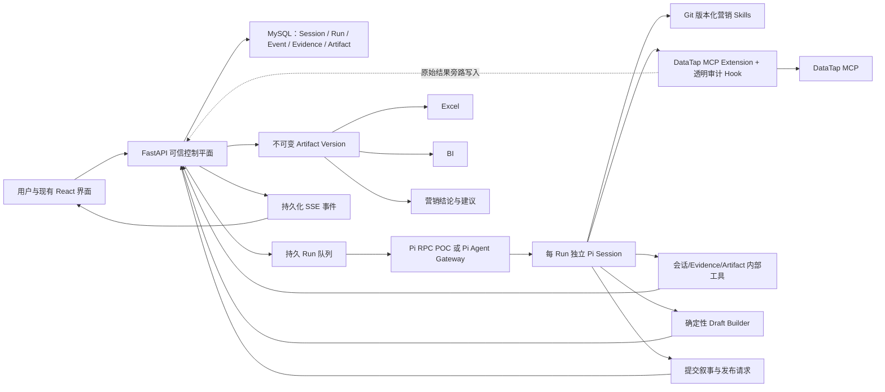

# Pi Agent Runtime 集成设计

> 状态：已确认，待按方案 A → 方案 B 分阶段实施
>
> 日期：2026-08-07
>
> 适用基线：`codex/agent-runtime` 当前最新代码，以及
> `2026-08-05-marketing-report-runtime-revision-design.md` 已落地的 Run、Evidence、
> Builder、Artifact Version、Excel 与 BI 契约。

## 1. 背景与目标

项目核心能力只有三条：用户通过对话获取社媒数据并生成 Excel、在同一系统查看 BI、
依据证据获得营销策略建议。现有自研 Runtime 在意图路由、MCP 编排、结构化产物和恢复
逻辑中加入了大量代码控制，模型仍难以达到通用 Agent 直接调用 MCP 的效果。

本设计用 Pi 承担模型交互和研究循环，让模型自主澄清、选择 Skill、调用 DataTap、判断
补查和结束；FastAPI 继续作为可信控制平面，负责身份、租户、License、队列、积分、
持久状态、Evidence、确定性 Builder、Artifact、Excel、BI 和审计。目标不是让 Pi 取代
整个后端，而是替换最不适合由业务代码硬编码的 Agent 决策层。

实施顺序固定为：

1. 方案 A：独立数据库、命令行驱动的 Pi RPC POC，先证明链路和效果。
2. 方案 B：生产 Node.js Pi Agent Gateway、多租户并发和管理端。
3. 方案 C：Marketing MCP Gateway，仅记录为未来设计，不在本轮实现。

## 2. 设计原则

- Pi 控制研究策略；代码控制安全、权限、状态、证据和产物一致性。
- 不再用代码识别品牌、活动或达人意图并选择 MCP 工具。
- Pi 直接看到 DataTap 原始工具目录、Schema、结果、空数据和错误。
- Excel、BI 和模型叙事必须消费同一个不可变 Artifact Version。
- 所有报告数值必须具有 Evidence lineage；缺失数据允许 `partial`，不允许编造。
- MySQL 是唯一事实来源；Pi Session 只是单 Run 的临时执行上下文。
- 每条用户消息创建新 Run；同一业务会话可以跨 Run 复用历史 Artifact 和 Evidence。
- POC 不考虑积分；生产化后才恢复 License、配额和透明预留结算。
- 首期禁用 Pi 的 Shell、read/write/edit 等内建工具，只开放审核过的营销工具。

## 3. 总体架构



### 3.1 保留在 FastAPI 的能力

- 登录、用户隔离、租户、角色与管理员审计。
- Session、Message、Run、Attempt、Event、上传和取消。
- Evidence 原始结果、受限模型视图、hash、来源路径和可用状态。
- 六类既有 Artifact Schema、Draft Builder、确定性发布、版本和导出缓存。
- Excel 生成、BI DTO、历史版本和同一版本下载。
- 方案 B 的 License、积分、并发、队列、配置快照和故障恢复。

### 3.2 交给 Pi 的能力

- 判断请求属于完整报告、继续钻取、策略问答、需要澄清或非营销请求。
- 自主选择并按需加载 Skill。
- 自主选择 DataTap 工具、参数、调用次序和补查策略。
- 读取 Builder 返回的数据覆盖与缺失，决定补查或接受数据受限。
- 基于已冻结 Evidence/Artifact 撰写分析叙事、营销建议和后续操作建议。
- 接收 MCP 原始错误并决定调整参数、换工具、澄清或结束。

## 4. DataTap 直连与透明 Hook

Pi 本身不内置 MCP；项目提供一个经过代码审核的 TypeScript Extension，直接作为 MCP
客户端连接 DataTap，并把发现到的工具注册给 Pi。该 Extension 不通过现有 Python MCP
编排器转发请求，以保持通用 Agent 直连 MCP 的研究效果。

Extension 内保留透明旁路 Hook：

1. 调用前记录 `run_id`、Pi tool-call id、工具名、参数 hash 和时间。
2. Extension 使用原始工具名和原始参数直接调用 DataTap。
3. 成功后把完整原始结果旁路写入 FastAPI Evidence Ingest，得到 `evidence_id`。
4. 原始 DataTap 响应不经业务归一化直接返回 Pi；只允许附加独立的
   `_runtime_metadata={call_id,evidence_id,recorded}`。
5. 错误、空结果和超时同样原样返回 Pi，并记录状态和诊断。

Hook 禁止修改请求、隐藏业务字段、提前归一化模型视图、选择重试、拆分查询、改换工具
或注入业务路由。DataTap token 只进入子进程内存或环境变量，不进入 Prompt、Skill、
事件、Artifact、日志和前端。

POC 不使用钱包、积分预留或结算，也不因余额阻断调用。方案 B 中 Hook 才在外发前增加
License/配额校验和积分预留，调用后结算或释放；这一控制不改变 MCP 请求和响应。

## 5. 报告闭环

正式报告采用“Pi 自主研究 → Draft Builder 反馈 → Pi 补查/收尾 → 确定性发布”：

1. Pi 自主澄清范围并调用 DataTap，透明 Hook 沉淀 Evidence。
2. Pi 判断用户需要报告时调用 `build_artifact_draft`，提交 `artifact_type`、业务 scope
   和 `evidence_ids`；具体实现适配既有六类 `build_*_draft` 工具，不允许手写强类型
   payload。
3. Builder 从 Evidence 归一数据，校验 lineage，返回 Draft、coverage、limitations 和
   明确的 gaps。
4. Pi 自主决定继续补查、缩小口径、询问用户或接受平台本身的数据缺失。
5. Pi 根据 Draft 的规范化摘要生成 narrative 和 marketing advice，并提交发布请求。
6. FastAPI 再次校验 Draft 所有权、Schema 和 lineage，幂等发布 Artifact Version。
7. Excel、BI 和会话结论只读取该 Version；不得各自重新查询或重新计算。

沿用以下现有 Schema，不新建“大而全”报告格式：

- `brand_report_v3`
- `campaign_report_v2`
- `kol_selection_v3`
- `kol_analysis_v2`
- `kol_detail_v2`
- `insight_board_v1`

## 6. 多轮会话

每条用户消息创建新的 Run 和临时 Pi Session。启动时从 MySQL 重建受控上下文：近期对话、
会话摘要、已发布 Artifact 摘要、Evidence 索引和用户显式引用的版本；不把整个历史原始
结果一次性塞入 Prompt。

Pi 可通过内部只读工具按需读取历史 Artifact Version、Evidence 预览和工具结果。普通
追问、解释或钻取优先复用已有证据；只有用户要求更新、时间范围变化或证据不足时才补查
DataTap。只有本轮目标是新的完整分析成果时才创建新 Artifact Version；普通追问只写
assistant 消息并列出依据。

同一会话只允许一个写入型 Run 同时运行。不同会话可以并行。Pi Session 不持久化，恢复
依靠数据库 transcript、Evidence 和 Draft，而不是 Pi 自己的 session 文件。

## 7. Skills

首期 Skills 位于仓库并由 Git 版本化：

```text
pi-runtime/skills/
  social-marketing-analyst/SKILL.md
  brand-research-report/SKILL.md
  campaign-evaluation-report/SKILL.md
  kol-selection-report/SKILL.md
  artifact-drilldown/SKILL.md
  marketing-strategy/SKILL.md
```

根 Skill 限定系统边界并指导 Pi 识别报告、钻取、澄清、策略咨询和非营销拒答；专项 Skill
定义业务目标、报告覆盖、证据要求、数据缺失语义和完成条件，但不固定 MCP 工具顺序。
品牌 Skill 引用脱敏后的“ChatGPT + DataTap 成功品牌分析”案例，案例只保留研究策略、
核验方式和收尾逻辑，不固定品牌、日期、结果和工具参数。

Pi 自主按需加载 Skill，FastAPI 不做意图到 Skill 的路由。每个 Run 快照记录实际加载的
Skill 名、版本和 digest。管理端首期只能选择启用的版本集合，不能在线编辑正文。

## 8. 方案 A：Pi RPC POC

### 8.1 隔离与执行

- 使用专用数据库 `kol_insight_pi_poc`，不得读写开发库或测试库。
- 从后端 CLI 脚本运行，不开发管理端和正式 UI。
- 当前 Runtime 与 Pi 使用完全相同的模型、provider、thinking 级别、用户问题、会话历史、
  日期范围和 DataTap 凭证。
- 每个 Run 启动一个 `pi --mode rpc --no-session --no-builtin-tools` 子进程；显式加载本项目
  Extension 与 Skills，并禁用未审核的自动发现资源。
- POC 串行，并发为 1；单 Run 最多 30 分钟、50 次模型决策。
- Run 完成、失败、取消或超时后结束子进程；记录严格 JSONL RPC 轨迹。
- Pi CLI/SDK 包名与版本必须在技术探针中以官方当前发行版确认并锁定。官方仓库已从
  `badlogic/pi-mono` 跳转到 `earendil-works/pi`，不得依赖浮动的 `latest`。

### 8.2 MCP 异常

代码层不做业务重试、工具切换、参数改写或现有空结果熔断。单次 MCP 基础设施超时默认
180 秒并可配置；成功、空数据、参数错误、超时和供应商错误原样交给 Pi。Skill 只要求
模型识别错误并避免无变化的重复调用。最终可发布 `partial`，但必须列出缺失项、已尝试
查询和限制。

### 8.3 六个验收场景

1. 品牌调研 → Artifact、Excel、BI、营销建议。
2. 活动评估 → Artifact、Excel、BI、营销建议。
3. 达人圈选 → Artifact、Excel、BI、营销建议。
4. 基于既有 Artifact/Evidence 钻取，不无故重跑完整查询。
5. 模糊输入由 Pi 主动澄清，未满足范围时不发布报告。
6. 非营销输入明确说明系统只提供社媒营销能力。

每个案例分别运行 current 与 pi，交替执行顺序，结果追加写入
`outputs/pi-runtime-poc/`。硬门槛：三个主报告都可发布且 Excel/BI 同版；数值均可追溯；
澄清、钻取、拒答正确；MCP 错误被真实回喂；无密钥泄漏。对比目标：Pi 的三个主流程
数据覆盖不低于 current，且 MCP 参数有效率、产物完整性、分析可读性至少两项更好。

## 9. 方案 B：生产 Pi Agent Gateway

### 9.1 服务与进程

新增独立 Node.js Gateway 服务，使用 Pi SDK 创建 AgentSession；FastAPI 不直接持有 Pi
对象。首期采用共享 Worker 池，每个 Run 独立 Pi 子进程/Session，结束即销毁。不同租户
共享容量但不共享会话、Prompt、工具状态或密钥。未来可增加租户专属 Worker 池。

FastAPI 接收消息后立即创建 `queued` Run。Gateway 按全局容量、租户并发、用户并发、
会话互斥领取；同优先级按创建时间并做租户公平调度。管理员调整 Worker 数和并发采用
draining，不杀死正常任务。

### 9.2 配置、安全与多租户

配置采用系统默认 + 租户覆盖，不提供用户级模型/MCP 配置。每个 Run 保存不可变
`runtime_config_snapshot`，包含配置版本、模型、脱敏端点、限时、Skill digests 和计费
策略。密钥加密存储，API 只返回掩码，启动子进程时临时注入。

后台管理模块：租户、用户、License、用量与积分、Pi Runtime、模型与 MCP 配置，以及
只读 Run 诊断。所有写操作审计。License 控制有效期、功能和并发；租户使用共享积分池，
用户可设周期额度。模型 Token 首期只记录成本，MCP 调用继续按业务积分结算。

### 9.3 事件、取消与恢复

Gateway 把 Pi RPC/SDK 事件交给 FastAPI，FastAPI 持久化为稳定产品事件并通过现有 SSE
输出。Thinking 流式显示且默认折叠；工具步骤只展示脱敏摘要；前端不直连 Gateway。

DataTap 错误不自动恢复。仅 Gateway/Worker 崩溃、RPC 断开等基础设施故障可新建一次
Attempt，从数据库重建上下文。崩溃时状态不明的 MCP 调用标记 `unknown`，不作为成功
Evidence。Artifact Draft 与发布必须幂等；第二次基础设施失败后 Run 明确失败。用户取消
不恢复。

### 9.4 灰度

租户级 `runtime_backend=current|pi` 决定新 Run 的执行器；同一真实消息只允许一个
Runtime 执行。先内部租户，再灰度租户，再设为新租户默认。切换只影响新 Run。当前
Runtime 保留一个稳定发布周期作为回滚，不在本次集成中删除。

## 10. 不在本轮范围

- 不让 Pi 直接写 MySQL、Excel 文件或前端状态。
- 不开放 Shell、文件编辑、任意 HTTP 或第三方未审核 Extension。
- 不在 POC 开发积分、License、管理端或高并发。
- 不同时研究第二个模型；current 与 Pi 只使用同一模型。
- 不支持多品牌合并调研；单一品牌和单独竞品调研沿用当前产品约束。
- 不实施方案 C Marketing MCP Gateway。

## 11. 官方 Pi 依据与版本风险

Pi 官方文档确认 RPC 使用 stdin/stdout JSONL、支持 `--no-session`、`abort` 和流式事件；
SDK 支持 `createAgentSession`、内存 SessionManager、Extension 和 Skill；Pi 不内置 MCP，
需要 Extension；`--no-builtin-tools` 可关闭内建工具并保留扩展工具：

- https://github.com/earendil-works/pi/blob/main/packages/coding-agent/docs/rpc.md
- https://github.com/earendil-works/pi/blob/main/packages/coding-agent/docs/sdk.md
- https://github.com/earendil-works/pi/blob/main/packages/coding-agent/docs/skills.md
- https://github.com/earendil-works/pi/blob/main/packages/coding-agent/docs/extensions.md
- https://github.com/earendil-works/pi/blob/main/packages/coding-agent/docs/usage.md

Pi 项目名称和 npm scope 近期发生过变化，因此方案 A 的第一个 Gate 必须验证并锁定实际
CLI、包名、版本、RPC 事件和 Extension API，不能把文档示例当作永远稳定的契约。

## 12. 通过条件与后续提醒

只有方案 A 六类场景满足 §8.3，才允许进入方案 B。方案 B 完成并通过真实多租户 UAT 后，
必须提醒用户评估是否启动单独记录的 Marketing MCP Gateway 方案；未经用户再次明确确认，
不得实现方案 C。
