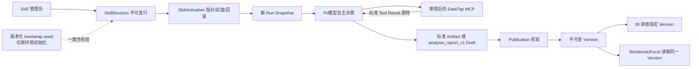
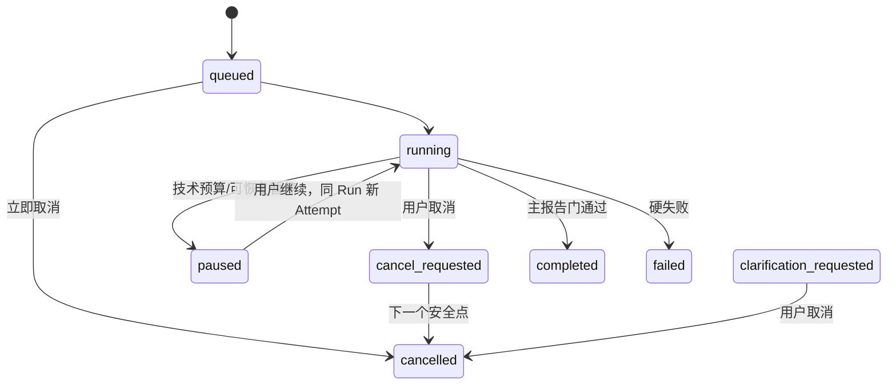
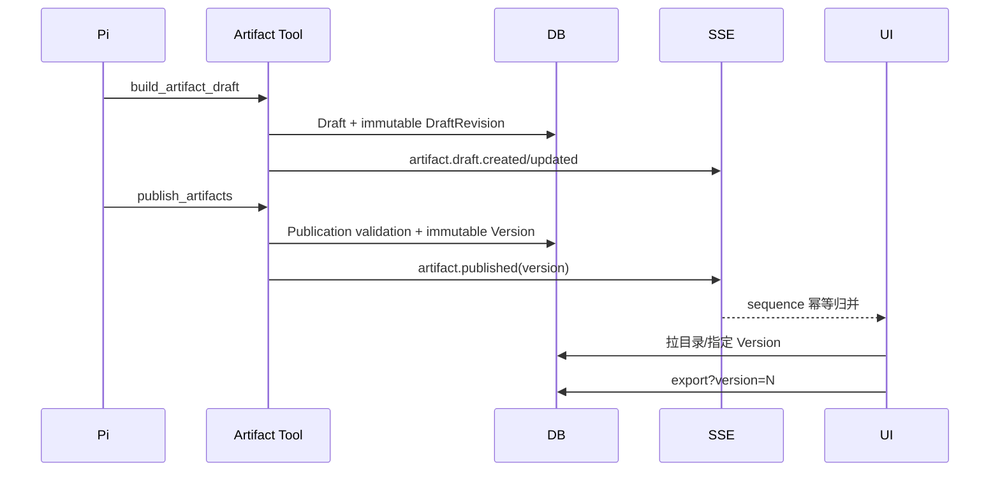

# 品牌之后的营销能力功能架构设计

> 日期：2026-08-22  
> 状态：待实施，已完成设计  
> 设计 Goal：`PI_POST_BRAND_FUNCTIONAL_DESIGN_GOAL`  
> 基线：`origin/main@d0a16b9524c556c31bb894916069cc02ec2cd131`  
> 范围：品牌能力固化、达人圈选、自由组合报告、交互控制、Skill 管理与 Artifact 生命周期  
> 明确排除：全部活动分析专项设计与实现

## 1. 背景与当前事实

### 1.1 已核验的代码与运行事实

本设计以 2026-08-22 的远程 `main` 为事实基线，不把旧设计稿或旧 UAT 结论当作当前实现。

1. 数据库营销 Skill 已有 `SkillRevision`、`SkillActivation`、global/tenant scope、稳定灰度桶、previous 指针、回滚、轻量校验、diff、管理端幂等与审计。迁移 head 为 `0049_skill_rollout_history`。
2. `RuntimeConfigService.snapshot_for_new_run` 会把当前数据库 Activation 解析为不可变 `skill_manifest`；`snapshot_for_existing_run`、child/recovery/resume 只校验并复用已保存的 Snapshot，不重新读取当前 Activation。
3. production capability pack `marketing-v2` 仍标识 `1.1.0`。包内 Skill 当前既是基线内容，也是数据库缺项时的实际回退内容；这一点尚未达到“数据库是生产唯一事实源”的目标。
4. 2026-08-22 成功的瑞幸咖啡 B Run 为 `a04213cf…`：单个用户业务 Run、一个 Attempt、13 次 settled、3 次 `failed_confirmed`、0 次 unknown、终态预留为 0；发布 `brand_report_v3` Version 1（restricted），BI 与 24,250 字节 Excel 均读取该 Version。
5. 成功 Run 使用的动态 Revision 不是 `brand-research-report@3`。已记录的 Revision 3 是根 Skill `social-marketing-analyst@3`，Revision ID 为 `4eb2581a-6411-41ca-8bdb-7fb6487d21d0`，digest 前缀为 `0ba44fbd…`；“品牌 rev3”只能作为这组成功 Run Skill Snapshot 的简称，不能伪造一个不存在的 `brand-research-report@3`。
6. 成功 Run 之后，`main` 又加入 Pi 墙钟 watchdog、MCP 失败分类与串行闸、Pi 专属 Artifact SSE 补发、事件 backpressure、登录等修复。因此“品牌业务链成功”与“当前完整代码已做同一轮真实复核”是两个不同事实。
7. Pi 完成门 `CompletionValidator` 已要求普通、用户可见、formal analysis Run 发布至少一个当前 Run 所属的顶层主 Artifact；它不要求固定 Artifact 类型。clarification、utility、`kol_detail_v1` 和显式 interaction 可豁免。
8. `analysis_report_v1` 与 `workbook_v1` 已具备强类型 Block、fulfillment、可选布局、HTTP(S) URL、公式注入防护、技术上限、Version 绑定和导出缓存。它不设置 Top20/Top40 业务上限。
9. 现有 `kol_value_score_v3` 是服务端纯计算器，效果与匹配度 70 分、价格效率 30 分，缺失维度不重分配权重，评分结果带版本、维度、缺失原因和数据完整度。
10. Evidence Builder 路径会调用服务端 `rank_kols`；但 Pi 的直接 `build_artifact_draft(artifact_type="kol_selection_v3")` 目前仍允许模型提交完整 `data.scoring`、`rank` 和 `score_snapshot`。这是本设计必须关闭的可信边界缺口。
11. 管理端 Skill 工作台已能 validate、创建不可变 Revision、diff、global/tenant 激活、灰度和 rollback；当前 UI 未提供 Skill 审计时间线，Activation 展示也没有同时显示 active/previous digest。
12. Pi Artifact 事件由 `backend/app/pi_gateway/internal_tools.py::append_artifact_tool_events` 在 Pi 专属 internal-tool 边界补发；旧 agent engine 仍在自己的执行外围发事件。该分层避免同一工具在两条路径双发。
13. 当前 clarification 是“原 Run 进入 `clarification_requested`，用户回答创建带 `parent_run_id` 的新 Run”；paused/resume 则复用同一 Run、新建 Attempt、复用原 Skill Snapshot。两者不能混为一谈。
14. 取消已具备 durable `cancel_requested`、decide 后 dispatch 前安全点、唯一 `run.cancelled` 和 draft 释放；仍需补 clarification 前零副作用门、Pi/前端跨阶段验收和在飞账务断言。

### 1.2 CodeGraph 覆盖说明

本轮先使用了 CodeGraph 的 status/context/explore。索引健康检查能返回仓库图，但对 `marketing_skills`、`pi_gateway`、`agent_artifacts` 和 `pi-gateway/src` 的近期文件覆盖明显落后于 `d0a16b9`，甚至返回已移除的旧评分文件。为避免把旧图误当当前实现，本设计对 CodeGraph 未覆盖的新增目录采用精确文件读取；没有在 docs-only 会话中重建或改写 `.codegraph/`。实施会话若要依赖结构图，必须先在其隔离 worktree 中确认索引与 HEAD 一致。

## 2. 目标、非目标与不变量

### 2.1 目标

- 把已验证品牌能力的真实 Skill Snapshot 固化为可追踪、可回滚、可在新环境复现的数据库默认 Revision 集合。
- 关闭模型可直接提交 KOL 官方分数的缺口，让标准达人报告和通用组合报告共享同一个服务端评分投影。
- 让 Pi 能自主完成品牌、达人和自定义 Workbook 的自由组合请求，同时保证明确分析任务一定产生主报告。
- 把 clarification、cancel、pause/resume、Artifact SSE、未读、历史 Version、同版导出和只读钻取连成可验收的产品链。
- 把现有 Skill 管理 API 产品化为可浏览、可审计、可验证 Snapshot 不变性的管理工作台。
- 用最小 RED、任务级受影响测试和一次最终离线验证替代重复大规模 Gate。

### 2.2 非目标

- 不设计、修改或验证 `campaign-evaluation-report`、campaign Artifact、campaign 专属 BI/Excel、活动期/基线期/观察期、归因或 ROI。
- 不规划 capability Pack 1.3.0，不创建 campaign corpus/eval/UAT Task。
- 不恢复 Evidence Bridge、`mcp_result_v1` 或任何 adapter 业务有效性分类。
- 不把 evaluator/corpus Gate、固定阶段、固定工具顺序、固定工具次数、关键词 Artifact 路由或 GoalPolicy 放进生产 Runtime。
- 不设计支付、充值、历史 Evidence 恢复、历史 round 重跑、部署或 main 集成动作。

### 2.3 不变量

1. Pi/模型决定是否澄清、工具集合、顺序、数量、失败降级、Artifact 类型和 Workbook 布局。
2. 代码只守权限、归属、计费、状态、幂等、Schema、Version、Snapshot、安全和技术预算。
3. 正常 DataTap MCP Tool Result 的内容原样进入模型；账务分类只使用独立 metadata，不改写业务 content。
4. `result_unknown` 不自动重放、不自动释放预留，进入恢复/人工核对。
5. 明确且正常执行的用户分析 Run 必须发布至少一个当前 Run 顶层主报告；数据不全时发布 restricted，不以“没数据”放弃报告。
6. BI 与 Excel 始终读取同一个不可变 `AgentArtifactVersion`；Excel 不从最新 Draft、当前 Skill 或重新计算结果取值。
7. null 保持 null，界面/Excel 显示“未采集”或“数据受限”，不得转成 0。
8. Skill Revision 不可变；Activation 只影响新 Run；running、recovery、resume 使用原 Snapshot。
9. 所有 tenant/user/session/run/artifact/version 查询都做归属限制；模型看不到 token、DSN、JWT、密钥或管理员凭证。

## 3. 方案比较与选择

| 方案 | 生产 Skill 事实源 | 报告模型 | 优点 | 主要问题 | 结论 |
|---|---|---|---|---|---|
| A | 数据库 `SkillRevision`/`SkillActivation`；package 仅 bootstrap | 标准 Artifact 与 `analysis_report_v1` 并存，Pi 自主选择，共享 Workbook 投影 | 可快速发布/灰度/回滚；Snapshot 稳定；标准 BI 不丢；组合请求不被标准 Schema 限制 | 必须建立 seed/DB/digest 漂移防线，并补直接 KOL 输入可信边界 | **推荐** |
| B | DB 与 package 每次同步发版 | 两类报告可并存 | 代码仓库容易看到最新文案 | 形成双写；每次文案更新都要应用发版；回滚和灰度速度慢；运行事实容易与包版本混淆 | 不采用 |
| C | 数据库 Skill | 所有请求只用通用 Report，移除标准 Artifact | 单一输出形状 | 破坏既有品牌/达人 BI、历史 Version 与模板；通用表失去稳定业务语义；迁移风险大 | 明确排除 |

选择 A 的原因是：它同时支持生产快速修改与回滚、保持 Run Snapshot 不变、不要求每次 Skill 文案调整发应用、保留标准品牌/达人 BI、允许跨域请求使用通用 Report，并复用既有 Version、Excel 和计费边界。

## 4. 推荐架构总览



核心分层如下：

- **决策层**：Pi 和 Skill 文案；只提供能力、原则、Schema 与错误反馈，不编排固定阶段。
- **可信输入层**：模型输入 DTO；拒绝 server-owned 字段。KOL 候选事实可由模型选择，官方评分必须由共享服务端投影生成。
- **运行内核**：归属、取消、租约、MCP 账务、Snapshot、完成门与事件顺序。
- **产物内核**：Draft → Publication → Version，强类型、restricted/null、不可变历史和导出缓存。
- **表现层**：标准 BI、通用 Block BI、指定 Version 选择、浏览器下载和未读提示。

## 5. Skill Revision、Activation 与 Snapshot

### 5.1 单一生产事实源

生产执行只认数据库：

- `SkillRevision.content` 和 `content_digest` 是运行正文与摘要的唯一生产事实；
- `SkillActivation` 决定 environment + global/tenant + rollout 的当前/上一 Revision；
- `runtime_config_snapshot_json.skill_manifest` 是某个 Run 的不可变执行事实；
- package 只能用于新环境 bootstrap、契约装载和灾难诊断，不能在生产 Activation 缺项时静默成为运行正文。

`SkillSnapshotService.resolve_for_new_run` 的 production 语义要改为 fail-closed：Snapshot 所需的每个生产 Skill 都必须解析到数据库 Activation 和 digest 一致的 Revision。缺项返回 `skill_activation_incomplete`，不得回退到 package Skill。

### 5.2 bootstrap seed 与数据库同步

采用版本化、只增不改的 bootstrap bundle；首个文件是：

`backend/app/marketing_capability_pack/packs/marketing-v2/bootstrap/post-brand-default-v1.json`

该 bundle 保存：

- skill name；
- 规范化完整正文；
- SHA-256 digest；
- artifact contract 与 required tools；
- 来源 Revision ID/digest；
- 成功 Run Skill Manifest digest；
- seed bundle 自身 digest；
- 是否作为默认 Activation。

同步规则：

1. 只从成功 Run 持久化 Snapshot 和指定 Revision 行导出完整规范化字节；不得根据 changelog 摘要重写正文。
2. 导出时重新计算 digest，并同时核对 Revision 行、Run Snapshot entry 和 bundle 三者完全相同。
3. `0050_post_brand_skill_defaults` 只做 Revision 的 additive insert/upsert-by-identity：目标行不存在则插入；同一稳定身份已存在且 digest 相同则幂等；digest 不同则以 `skill_seed_digest_conflict` 失败，不覆盖。migration 和应用 startup 都不移动 Activation。
4. 新环境在 migrations 后必须显式运行一次 `initialize_marketing_skill_defaults --new-environment`；该命令校验 bundle digest、当前指针仍是审计基线且没有管理员变更后，原子设置默认 active/previous 并写审计。已有环境不得运行 initializer，只能经管理 API/UAT 授权切换 Activation。因此“新环境默认”与“升级现有生产”不会被 migration 猜测混为一谈。
5. package 的普通 Skill 文件、bootstrap bundle、迁移常量和文档只记录一个 bundle digest；静态测试对内容/digest/metadata 做全量相等断言。
6. 未来纯文案更新只创建新的数据库 Revision；不要求立即修改 package 或应用版本。只有正文与新代码合同耦合、或需要改变“新环境默认值”时，才新增另一个不可变 bootstrap bundle 和 additive migration。本计划的 KOL 模型输入与通用报告 fulfillment 合同分别使用后续 bundle/`0051`、bundle/`0052`，仍不升级 Pack 版本。

这不是运行时双写：package/bundle 只在 migration/显式新环境初始化时产生数据库行与初始指针；Run 创建之后只读 DB/Activation，再冻结到 Snapshot。

### 5.3 “品牌 rev3”固化与自主性冲突处理

固化对象是成功 B Run 的**完整 Skill Snapshot 集合**，不是凭名称猜测的单个品牌 Skill。已知 Revision 3 是 `social-marketing-analyst@3`；`brand-research-report` 的 Revision 与 digest 必须取成功 Run Snapshot 的真实 entry。

另有一个必须显式处理的事实：现有 rev3 变更记录包含“单轮调用不超过 3”一类数字化模型指令，而本轮不变量禁止固定工具调用次数。处理方式如下：

1. `social-marketing-analyst@3` 原文、ID 和 digest 永不修改，作为已验证历史与回滚基线固化进 bootstrap bundle。
2. 新增 policy-compliant successor Revision，其正文只保留定性止损：同族重复服务端失败后停止无效变参探测、保留 settled 结果、优先覆盖而非穷举、需要时由模型自主决定是否重聚合；不出现固定阶段、顺序或调用数量。
3. successor 通过代表性单/双平台、空/部分、高量、自定义 Workbook、模糊澄清的最小验收后才成为新的 default Activation；在此之前 rev3 仍是 active/previous 中可明确识别的验证基线。
4. rollback 只交换 active/previous 指针与 rollout 百分比，不修改任何 Revision；旧 Run 继续使用自己 Snapshot 中的 digest。

因此，“固化 rev3”表示保留精确可复现基线和回滚点；最终默认 Revision 同时满足已验证意图和当前模型自主原则，不能通过篡改 rev3 原文实现。

### 5.4 新 Run、clarification child、recovery 与 resume

- 普通新用户 Run：解析当时 Activation，生成新 manifest。
- clarification 回答：按当前实现创建新的 child Run，因此解析回答时的新 Activation；parent Run digest 仍留在历史，二者通过 `parent_run_id` 审计。
- paused/resume：同一 Run、新 Attempt，复用原 manifest。
- worker crash/recovery：同一 Run，复用原 manifest。
- utility/kol-detail child：使用父 Run Snapshot 或既有 child Snapshot 规则，不在执行中读最新 Activation。
- rollback 后的新 Run：使用回滚后的 Revision；回滚前的 running/recovery/resume 不变。

## 6. 品牌分析能力固化

### 6.1 标准品牌报告边界

`brand_report_v3` 继续承担稳定品牌 BI：品牌、周期、平台、概览、情感、趋势、内容类型、达人层级、地域、话题、热门帖子、叙事和 limitations。它适合用户请求能完整映射到标准 Schema 的情况。

Pi 可以选择 `analysis_report_v1`，当请求包含：

- 跨品牌与达人域的组合；
- 标准 Schema 没有的自定义列；
- 明确的单 Sheet/跨平台统一表头布局；
- 需要把多种记录类型融合在一个 Workbook 投影中。

这只是 Skill 提供的表达能力说明，不是代码关键词路由。Runtime 不根据“品牌”“Excel”等词推导 Artifact 类型，也不要求某个固定 contract。

### 6.2 代表性验收而非重复 Gate

品牌能力只保留六类代表性场景：单平台、双平台、空/部分数据、高数据量、自定义字段/Excel、模糊请求澄清。每个真实验收场景最多一个业务 Run；不重复 60-observation、三轮或十轮稳定性循环。

通过条件：

- 明确请求发布主报告；
- 空/部分数据发布 restricted 并有 limitations；
- null 不变 0；
- BI/Excel Version ID 相同；
- MCP 账务最终 settled/failed_confirmed/unknown 与钱包恒等；
- terminal 前事件有序且无 overflow；
- 不依赖固定工具顺序或数量。

## 7. 达人圈选与服务端确定性评分

### 7.1 输入、职责与去重

新模型输入契约只允许模型提交：

- 用户确认范围：平台、品牌/品类、受众、预算、目标数量、粉丝区间、地域、内容方向、排序偏好；
- 候选事实：`platform`、稳定 `kol_uid`、昵称、主页/内容 URL、粉丝/互动/有效粉丝、受众分布、内容标签、报价和内容形式；
- 模型叙事：选择原因、风险、使用建议和 supporting paths；
- fulfillment 的业务目标 `requested_min`，但实际数量和状态由服务器产生。

模型输入使用不含 `campaign` 字段的 `KolProjectionScopeV1`；服务器只为兼容既有 `kol_selection_v3` payload，把历史字段 `campaign` 固定写为 null。本轮不借达人筛选入口引入任何活动分析语义。

去重键固定为 `(canonical_platform, kol_uid)`：

- 同平台同稳定 ID 合并为一个候选，保留最完整的非冲突事实；冲突值记录 limitation，不凭模型猜选。
- 同一自然人跨平台有不同平台/ID，必须保留为两个身份；昵称、手机号样式文本或主页显示名不得跨平台合并。
- 缺稳定身份的行不能进入官方评分名单；可以在 restricted 通用报告中作为“身份不可验证记录”披露，但不能伪造 kol_uid。

### 7.2 共享评分投影

新增一个共享 `KolScoringProjectionService`，标准 `kol_selection_v3` 和 `analysis_report_v1` 的 KOL 投影都调用它；`rank_kols` 继续调用同一纯计算核心。服务端生成并拥有：

- 规范化评分输入；
- `rank`；
- `data.scoring` 的 version/method/weights/missing policy；
- `score_snapshot` 全部数值、rating、data completeness、missing reasons；
- candidate/selected count、platform/rating distribution；
- `requested_min`、`actual_count`、`status`、`reason`；
- 稳定去重结果和评分版本。

模型只拥有：

- 选择哪些真实候选进入投影；
- 排序偏好（effect/balanced/price）；
- 对服务端分数的文字解释、风险和建议；
- 自定义报告中非官方的业务叙事。

任何模型输入出现 `rank`、`score_snapshot`、`value_score`、`effect_score`、`price_efficiency_score`、`rating`、`data.scoring` 或服务器 fulfillment 结果时，返回 `kol_score_server_owned_field_rejected`，并给出 RFC 6901 路径。

### 7.3 原始事实到评分输入

服务端从原始事实确定性派生：

- 平均互动、粉丝量：沿用 `kol_value_score_v3` 的按平台 winsorize + mid-rank percentile；
- 有效粉丝率：优先真实 rate，否则用 count/followers 计算；
- 互动粉丝比：优先真实 ratio，否则用 average interactions/followers 计算；
- 内容匹配：标准化内容标签与用户确认方向的集合匹配；
- 行业兴趣、目标地域、目标年龄：从候选受众分布和确认 scope 求和/归一；
- 报价效率：只使用大于 0 且匹配确认内容形式的报价，样本不足 3 时按现有合同记 0 并披露。

模型不能直接提供上述 0–100 归一分。若单个事实缺失，现有 missing-as-zero 合同仍可计算，但对应 `missing_reason`、`data_completeness`、availability 和 limitation 必须使报告 restricted。若评分器版本缺失、输入类型不满足合同、身份不可验证或评分投影无法完整组装，则 fail-closed：

- 不生成官方分数、rating 或按分排名；
- 标准 `kol_selection_v3` 构建返回 `kol_score_contract_unavailable`；
- Pi 可自主选择发布 restricted `analysis_report_v1`，只展示真实候选事实和链接，并明确评分不可得；
- 不用模型分数填洞。

### 7.4 标准与通用报告的选择

`kol_selection_v3` 保持稳定 Top20 BI 和历史兼容，不在 v3 内偷偷扩张业务上限。新输出在 summary 增加可选、服务器生成的 fulfillment；历史 Version 没有该字段仍可读取/导出。

与模型输入合同同步新增不可变 `kol-selection-report@3` 及 `kol-selection-server-score-v1` bootstrap bundle/`0051`。该 Revision 只描述候选事实、服务端评分字段边界、数量不足和标准/通用报告选择，不规定工具顺序或次数。migration 只插入 Revision；新环境 initializer 可设为默认，已有环境必须经管理 API 和授权验收激活。

当用户要完整数量超过标准 Top20、需要跨域数据或自定义列时，Pi 可选择 `analysis_report_v1` 的 KOL server projection，或同时发布标准 Top20 与一个通用主报告。Runtime 不强制二者组合。

例：用户要求 40 个达人，真实唯一稳定身份只有 27 个：

- 通用报告输出全部 27 个，不补造 13 个；
- fulfillment 为 `requested_min=40`、`actual_count=27`、`status=partial`；
- availability/limitations 使 Version 为 restricted；
- BI 与 Excel 都显示 27/40 和原因。

## 8. 自由组合 `analysis_report_v1` / `workbook_v1`

### 8.1 输入层扩展

保持最终 `analysis_report_v1` Block 联合不变，扩展模型输入层：

- `blocks`：模型拥有的 metric/table/time-series/link/chart/narrative/methodology Block；
- `kol_projections`：模型把候选事实、scope、requested_min 和排序偏好绑定到一个已提交的目标 typed table；服务器把带官方评分的 KOL 行追加进这张共同表；
- `fulfillment_requests`：模型只提交 `key`、目标 table、记录类型、去重键、必需非空列和 `requested_min`；服务器从最终去重行计算 `actual_count/status/reason`，模型不得提交结果字段；
- `workbook`：模型选择 Sheet、Block、列、排序、冻结行和分页；技术上限由服务器校验。

普通 typed table 禁止使用官方 KOL 评分保留 key；只有 `kol_projections` 可以产生这些 key。服务器拒绝重复 Block ID、重复 fulfillment request key、目标不是 typed table、未知列、跨 Block 不一致列和超限布局。最终 Artifact 只保存服务器组装后的 Blocks 与 fulfillment，不保存输入 DTO。

与该输入合同同步新增不可变 `analysis-report@3` 及 `analysis-report-server-fulfillment-v1` bootstrap bundle/`0052`。它只把模型可写的 fulfillment 目标替换为服务器计数请求，保留既有 subject type 的共享兼容，不新增任何 campaign 阶段、口径、Schema、视图或验收。

### 8.2 正式验收蓝本

蓝本：

> 请分析最近2周餐饮品牌“牛霸霸”在小红书和抖音的数据表现，输出 Excel 格式到桌面。至少包含20条以上的爆文率及爆文链接，40条以上的达人链接，两个平台数据用同样的表头，融合在同一张表中，但有位置备注平台名字。

处理规则：

1. “最近 2 周”若未说明是滚动 14 天还是最近两个完整自然周，Pi 首次决策合并询问时间边界；若用户写“分期”等可能表示分阶段或误写周期的词，也在同一问题中确认，不用关键词直接猜时间窗。
2. “爆文率”若工具没有统一字段/口径，同一澄清中询问采用平台原生标记还是用户确认的阈值/公式；若用户接受默认方法，methodology 必须冻结公式、分母、时区和跨平台可比性限制。
3. clarification 成功前必须是 0 MCP、0 钱包变动、0 Draft/Version。
4. 用户回答后新 child Run 由 Pi 自主选择已审核的品牌/达人工具、顺序和数量；用户界面只展示“查询数据/整理报告”等业务文案，不暴露内部工具名。
5. 主报告使用 `analysis_report_v1`，subject type 为 mixed；Pi 仍可另外发布标准品牌/达人 Artifact，但 Runtime 不要求。
6. `workbook_v1` 使用一个数据 Sheet 和一个 `cross_platform_details` typed table。两个平台共用一套列：
   - `platform`
   - `record_type`（viral_post / kol）
   - `name`
   - `external_id`
   - `viral_rate`
   - `followers`
   - `engagement`
   - `url`
   - `note`
7. 所有小红书/抖音记录写入同一表，`platform` 明确标识来源；不为不同平台创建不同表头。自定义列只能扩展这一共同列集合。
8. post/达人链接均为 HTTP(S) URL；非 HTTP(S)、公式、宏、脚本和任意本机路径被拒绝。
9. fulfillment 至少包含 `viral_posts(20)` 和 `kol_links(40)`；不足时保留全部实际唯一记录，状态 partial/unavailable，绝不静默截断。
10. “输出到桌面”解释为浏览器下载。服务器返回带安全文件名的响应，不获得或写入用户桌面文件系统。
11. BI 渲染 `cross_platform_details` Block；下载 API 显式携带同一个 Version number，Excel 由该 Version payload 投影。

### 8.3 Workbook 技术边界

`WorkbookLimits` 是技术上限，不是业务 TopN。超过上限返回结构化 409：

```json
{
  "code": "WORKBOOK_TECHNICAL_LIMIT_EXCEEDED",
  "limit": "max_rows_per_sheet",
  "actual": 120001,
  "maximum": 100000
}
```

不截断、不重算、不调用模型/MCP。模型可以根据结构化反馈自主选择更窄的列/范围并重建 Draft；若仍不能导出，主报告可以 restricted 发布并明确“Workbook 不可生成”，但不能声称已下载。

公式注入在输入验证和 Excel cell 写入双层防护；URL 只接受 HTTP(S)；文件名经过清洗；缓存 identity 包含 `artifact_version_id + exporter_version + layout_digest`。

## 9. 主报告完成契约

### 9.1 必须有报告的 Run

普通用户从会话入口创建的 Pi formal analysis Run，在正常完成前必须存在至少一个：

- tenant/user/session/run 全部归属正确；
- 当前 Run 发布；
- 顶层 `parent_artifact_id is null`；
- schema 在该 Run Snapshot allowlist；
- Publication/Version/validation/lineage 快照合法；
- 类型为标准 Artifact 或 `analysis_report_v1`。

门禁只检查“至少一个合法主报告”，不检查固定类型、工具、阶段、调用次数或 Draft 数量。Pi 可以自主发布一个或多个主报告。

### 9.2 合法无报告出口

- `clarification_requested`：不是成功终态，等待用户回答；
- `cancelled`：用户明确终止；
- 系统/供应商硬失败：无能力可靠完成；
- utility child Run：不承载业务分析；
- `kol_detail_v1`：轻量详情/缓存能力；
- 显式 Version 只读钻取 Run：由专用入口冻结 `completion_requirement=read_only`，只允许历史读取能力。

Snapshot 合同新增 `completion_requirement: Literal["main_report", "read_only"] | None = None`。所有新 Snapshot 必须由服务端入口写入：普通消息固定 `main_report`，显式历史 Version 钻取入口固定 `read_only`。该值由入口类型而不是用户关键词、prompt 或模型输出产生；字段为 `None` 只服务历史行兼容，CompletionValidator 此时才读取旧 `completion_mode`。

## 10. clarification、cancel、pause 与 resume

### 10.1 clarification

`request_clarification` 增加不可绕过前置条件：当前 Run 不得已有外部 MCP ToolCall、钱包 reserve/settle/release、Artifact Draft/Revision/Publication/Version。零积分、无副作用的 `load_skill/get_context` 等内部只读调用可以存在；否则返回 `clarification_after_side_effect_not_allowed`，Run 继续由模型选择完成或失败，不能伪装成零成本澄清。

这不使用关键词判断请求是否模糊，也不强迫明确请求澄清；它只保证模型一旦选择澄清，就必须在任何业务副作用之前。

用户回答沿用当前语义：原 Run 保持 `clarification_requested`，新消息创建 child Run。新 child 是新 Run，使用回答时的新 Skill Activation；parent/child Snapshot digest 均保留审计。

### 10.2 cancel



取消规则：

1. queued/paused/clarification Run 可在锁内立即 cancelled；running/reviewing 只先写 durable `cancel_requested`。
2. 引擎在模型决策前、决策后 dispatch 前、工具返回后和 terminal 前检查取消；确认取消后不得再发新 dispatch、创建/更新/发布 Artifact 或创建 fresh 业务 Run。
3. `run.cancelled` 恰好一次，且是该 Run 最后一条用户可见事件。
4. 取消前已提交的 Artifact 事件保留；取消后不补发 Artifact 事件。未发布 Draft 释放 owner，但历史 Revision 保留。
5. `planned` 可以确认未发送；`reserved` 只有在 durable 状态仍证明“尚未进入 running、绝未外发”时才按 `definitely_not_sent` 释放。外发前必须先持久化 running，因此发送竞态不能停留在 reserved。
6. 已外发的 running 在取消收口时变为 `result_unknown` 并保留预留；迟到结果走原 finalize/reconcile，禁止自动重放。
7. 不用 Attempt=1 作业务门；recovery 可以产生新 Attempt，但不能在取消后启动未经授权的新业务执行。

### 10.3 pause/resume 与前端

- pause 是技术预算/可恢复暂停，不等于 cancel。
- resume 必须是同一 Run、新 Attempt、原 Snapshot；`cancel_requested` 或 cancelled Run 不可 resume。
- running/reviewing/thinking 显示“取消分析”；点击后禁用并显示“取消中…”。
- paused 只显示“继续”；clarification 显示回答输入/选项和“取消本次分析”；terminal 无操作按钮。
- 409/404/租约冲突展示稳定中文错误，不静默创建替代 Run。

### 10.4 事件顺序

- 正常完成：thinking/tool/review/artifact 事件 → durable assistant message → `message.completed` → 唯一 `run.completed`；warnings 只作为事件 payload/status metadata，不新增另一种 terminal event。
- clarification：0 副作用 → clarification assistant message → `message.completed(type=clarification)` → Run 状态保持 `clarification_requested`，不伪造 completed。
- cancel：已提交的 thinking/tool/artifact 事件 → 唯一 `run.cancelled`；取消路径不要求伪造 `message.completed`。
- failed：已提交事件和可用失败消息先落库，`run.failed` 最后。
- 所有 sequence 按 Run 行锁单调，SSE reducer 以 sequence 幂等；terminal 后拒绝新用户可见事件。

## 11. Artifact、BI、Excel 与钻取生命周期

### 11.1 生命周期



- Draft 是可连续修订 working head；DraftRevision 不可变。
- Publication 在一个事务中锁定归属、Schema、payload、lineage 和 Snapshot contract。
- Version 不可变，保存 source Run/revision、payload、data_status、validation 和 lineage snapshot。
- `artifact.draft.created/updated` 只说明草稿状态；只有 `artifact.published` 提高可读 Version 与未读水位。
- Pi 路径只在 Pi internal-tool bridge 发 `artifact.*`；旧 agent 路径只在 engine 外围发，禁止把补发逻辑下沉到 ToolRegistry。

### 11.2 前端、未读和 Version

- SSE 收到 draft/published 后增加 workspace refresh token；目录重拉必须按 session/user 归属。
- 未读按 `(user, session, module)` 的 activity sequence 计算；打开模块后推进水位，不能因 draft 误标已发布未读。
- Version selector 显示全部不可变 Version；选择历史 Version 后 BI、limitations、fulfillment 和下载按钮全部绑定该 version。
- 下载请求显式 `?version=N`；响应文件名含 `vN`。不允许 UI 显示 v1 却下载 latest v2。
- restricted 用明显 badge、limitations 和 fulfillment；null 统一显示“未采集”，不显示 0。

### 11.3 历史 Version 只读钻取

新增显式 Version 钻取入口，输入固定 `artifact_id + version + question`，创建 `completion_requirement=read_only` 的用户可见 Run：

- Snapshot 的 Profile 只允许 `read_artifact/search_evidence/read_tool_result` 三个历史只读工具，不允许 `remember_scope`、确定性计算、DataTap MCP 或 Artifact build/publish；
- 读取指定 Version，而不是 latest；
- 回答不创建新 Version，不改变未读/Artifact 稳定身份；
- 用户明确选择“生成新报告”时才从普通分析入口创建新 Run，恢复完整工具能力，并按主报告门发布新 Version。

因此，仅浏览/提问历史 Version 不会产生 DataTap 成本；“生成新报告”是显式产品动作，不靠关键词推断。

## 12. Skill 管理工作台产品化

### 12.1 现有能力保留

- validate：frontmatter、名称、允许字段、approved tool 白名单、越权声明、secret、路径和 digest；
- 创建 Revision：append-only、Idempotency-Key、规范化内容、审计；
- diff：数据库 Revision 内容；
- activate：global/tenant、environment、rollout percent、previous 指针；
- rollback：交换 active/previous Revision 与百分比，幂等审计。

每次保存不运行 corpus/eval 或真实服务。管理端只编辑 Skill Markdown 及其依赖声明；不能编辑 Root Policy、实际 Tool JSON Schema/allowlist、Runtime Config secrets 或凭证。

### 12.2 补充 API/UI

1. `SkillActivationRead` 增加 `active_content_digest`、`previous_content_digest`。
2. 新增管理员只读 `GET /api/v1/admin/skills/{skill_name}/audit-logs`，返回该 Skill 的 revision_create/activate/rollback 审计时间线；只返回 digest、scope、revision、rollout、actor/time，不返回完整正文或秘密。
3. UI 同时展示 Active/Previous Revision ID、revision number、digest、scope 和 rollout。
4. UI 增加审计时间线；重复 Idempotency-Key 的同请求显示同一结果，不产生重复 Revision/Activation/audit。
5. tenant 选择后，Revision/diff/activation 只允许 global + 该 tenant 的行；服务端继续做最终 scope 校验。
6. 非管理员统一 403；普通用户 API 不暴露 Skill 正文、Activation 或审计。

### 12.3 浏览器验收

本地真实浏览器先覆盖：创建、validate、diff、global/tenant 激活、0/部分/100% rollout、rollback、幂等重放、审计时间线、Active/Previous 展示、403 和 tenant 隔离。

Snapshot 验收同时保存三个 Run：

- 激活前创建的 old Run：digest A；
- 激活后创建的 new Run：digest B；
- old Run recovery/resume：仍为 A。

该验收只验证 Snapshot，不要求固定模型工具行为。真实环境浏览器/UAT 必须另行授权。

## 13. 权限、计费与安全

### 13.1 MCP 与账务

- adapter 不读取业务字段来决定 success/empty/unavailable；标准 Tool Result content 原样进入 Pi。
- `definitely_not_sent`：释放预留；模型可自主决定是否换方法。
- `failed_confirmed`：确认失败，释放预留，不自动重放。
- `result_unknown`：保留预留，Run 可带 warning/restricted 收口，后台恢复只读核对或管理员 reconcile。
- `settled`：结算固定 10 分并保存真实结果。
- cancellation、watchdog 和迟到结果都沿用同一状态机，不因报告功能放宽。

### 13.2 报告安全

- Artifact/Version/Export/Drilldown 均校验 tenant + user + session 归属；归属失败 404。
- 模型参数中的 user/session/run/tenant 保留键被剥离。
- URL 仅 HTTP(S)；公式前缀转义；拒绝宏、脚本、绝对本机路径和敏感模式。
- Excel storage key 不回给用户；导出缓存文件名清洗并校验 hash。
- Workbook 只表现已发布 Version，不执行模型提供的公式或代码。

## 14. 错误语义

| code | HTTP/终态 | 语义 | 可恢复方式 |
|---|---|---|---|
| `skill_activation_incomplete` | 新 Run 409/失败创建 | production DB 缺必需 Activation，禁止 package 回退 | 管理员补齐/回滚 Activation |
| `skill_seed_source_missing` | seed 工具失败 | 找不到指定 Revision/成功 Snapshot | 停止固化，不猜正文 |
| `skill_seed_digest_conflict` | migration/initializer 失败 | 稳定身份已有不同 digest | 人工核对，不覆盖 |
| `skill_bootstrap_environment_not_fresh` | initializer 失败 | 目标环境已有管理员 Skill 变更，不能当新环境覆盖 | 改走管理 API 与授权 UAT |
| `kol_score_server_owned_field_rejected` | build tool failed | 模型提交官方评分字段 | 按 model input schema 重试 |
| `kol_score_contract_unavailable` | build tool failed | 评分器/输入合同不能可靠计算 | restricted 通用报告，不产假分 |
| `clarification_after_side_effect_not_allowed` | tool failed | 已有 MCP/钱包/Artifact 后试图伪装澄清 | 继续完成或明确失败 |
| `pi_gateway_main_artifact_missing` | completion blocked | formal analysis 没有合法主报告 | Pi 创建/发布标准或通用报告 |
| `WORKBOOK_TECHNICAL_LIMIT_EXCEEDED` | export/build 409 | 超技术上限且禁止静默截断 | 缩小布局或披露无法导出 |
| `ARTIFACT_EXPORT_UNSUPPORTED` | export 409 | 类型/未发布 payload 不支持导出 | 选择受支持已发布 Version |
| `result_unknown` | warning + reserved | 请求可能已发送，结果不确定 | 恢复核对/人工 reconcile，绝不自动重放 |
| `run_cancel_requested` | 409/执行停止 | 已请求取消，禁止新 dispatch/resume | 等待唯一 cancelled 终态 |

错误消息不得包含工具完整参数、MCP content、token、DSN、路径或管理员秘密。

## 15. 验收矩阵

| 能力 | 最小验收 | 不变量/断言 | 实施 Task |
|---|---|---|---|
| 品牌单平台 | 清晰请求 → 标准或通用主报告 | 一个业务 Run；BI/Excel 同 Version | 2、5、9、10 |
| 品牌双平台 | 两个平台正常/部分数据 | restricted/null；同口径展示 | 2、5、9、10 |
| 品牌空/部分 | 工具返回空或部分 | 不放弃报告，不造数 | 2、5、9 |
| 品牌高量 | 代表性高行数 | 不 overflow；不重复大 Gate | 2、5、9 |
| 自定义品牌 Workbook | 自定义列 | 安全列、Version cache key | 5、9、10 |
| 模糊品牌请求 | 首次 ask clarification | 0 MCP/0 Artifact/0 points | 6、9、10 |
| KOL 标准 Top20 | 有效候选池 | 所有 score/rank 服务端产生 | 3、4、9、10 |
| KOL 40→27 | 通用报告 | 输出 27；fulfillment 27/40；restricted | 3、4、5、9、10 |
| KOL 身份重复 | 同平台重复与跨平台同名 | `(platform, kol_uid)` 去重；不跨平台合并 | 3、9 |
| KOL 评分合同不足 | 类型/身份/版本缺失 | 无官方假分；restricted raw facts | 3、4、9 |
| 牛霸霸组合请求 | clarification 后自主执行 | 一个 Sheet/共同表头/platform/安全 URL/20+40 fulfillment | 5、6、9、10 |
| thinking 取消 | 模型思考时取消 | 无新 dispatch；唯一 cancelled | 6、9、10 |
| MCP 在飞取消 | 已进入 running 后取消 | result_unknown reserved；不自动重放 | 6、9、10 |
| pause/resume | paused 后继续 | 同 Run、新 Attempt、旧 Skill digest | 6、7、9 |
| Skill global/tenant | 创建→diff→激活→灰度→回滚 | 幂等审计、scope 隔离、new B/old A | 2、7、9、10 |
| Artifact SSE | build/update/publish | Pi/agent 各发一次；UI 自动刷新 | 8、9、10 |
| Version/未读 | 发布 v1/v2、切历史 | 未读水位正确；BI/导出选同 vN | 4、5、8、9 |
| 只读钻取 | 指定历史 v1 提问 | 0 DataTap、0 新 Version | 8、9、10 |

## 16. 迁移与兼容

### 16.1 数据库与 Skill

- `0050`、`0051`、`0052` 只新增品牌/root、KOL input、通用报告 input 的 seed Revision；不移动 Activation、不 drop 旧表、不改历史 Revision。新环境默认指针只由显式 initializer 设置。
- migration head 从 `0049` 线性前进到 `0052`；downgrade 保留已产生的业务审计/Revision，不删除可能已被 Snapshot 引用的不可变行。
- package `marketing-v2` 不升级为 1.3.0；campaign Skill、contract、builder/exporter version 均不变。

### 16.2 Artifact

- 历史 `brand_report_v3`、`kol_selection_v3`、`analysis_report_v1` Version 原样可读/导出。
- `kol_selection_v3` 最终 payload 只做 additive optional fulfillment；历史缺字段时 UI 显示“未记录请求下限”，不推断。
- direct model input schema 可从 v1 升为 v2，因为它只影响新 Run 的 Skill Snapshot；已发布 payload schema 不改。
- 新通用 KOL projection 最终仍投影为已有 typed table Block，不引入新的最终 Artifact 类型。

### 16.3 Runtime

- 新 Snapshot 使用 `completion_requirement`；旧 Snapshot 继续读取 `completion_mode`，不回写历史行。
- Pi Artifact SSE 保持专属 bridge；旧 agent engine 不迁移到 bridge。
- 现有 `result_unknown`、账本、钱包和 reconcile 表不变。

## 17. 风险与延期事项

| 风险/延期 | 处理 |
|---|---|
| 成功 B Run 之后又有 watchdog/SSE/login 修复，当前组合未真实复核 | Task 10 只生成授权包；获得新授权后每场景最多一个业务 Run |
| rev3 原文包含固定调用数量，与新自主原则冲突 | rev3 不改、作为回滚基线；新 successor 去掉数字化编排并经代表性验收后激活 |
| 模型选择的候选事实仍可能有语义错误 | 强类型、稳定身份、URL、安全与评分输入确定性校验；不恢复 Evidence Bridge；limitations 诚实披露 |
| Workbook payload 可接近内存/文件上限 | 构建前/导出时统一结构化技术限制；不静默截断 |
| 只读钻取与普通聊天容易混淆 | 只由显式 Version 钻取入口设置 read_only；普通消息仍需主报告 |
| CodeGraph 当前索引落后 | 实施前确认索引与 HEAD；未更新前使用精确源码读取，不信任旧节点 |
| campaign 共享通用能力兼容 | 仅要求既有 campaign payload/BI/Excel 回归不变；不创建任何 campaign 专项任务或验收 |

## 18. 十六项架构决策结论

1. **production Skill 单一事实源**：数据库 `SkillRevision`/`SkillActivation`；Run 执行事实是冻结 Snapshot。
2. **seed 同步**：版本化 immutable bootstrap bundle + 只插 Revision 的 additive migration + 显式新环境 initializer + digest 全相等测试；初始化后不双写运行时，升级现有生产不自动移动 Activation。
3. **品牌 rev3 固化/回滚**：精确保存成功 Snapshot 和 `social-marketing-analyst@3` 为历史/回滚基线；不篡改；policy-compliant successor 经代表性验收后成为默认，回滚交换指针。
4. **达人评分职责**：所有官方输入归一、分数、rank、rating、snapshot、fulfillment 由服务器生成；模型只选候选/偏好并解释。
5. **标准或通用报告**：标准 Schema 能无损表达时可选标准；跨域/自定义列/布局用通用；Pi 决定，代码不关键词路由。
6. **主报告保证**：CompletionValidator 只要求至少一个合法顶层主 Version，不限制工具或类型。
7. **合法无报告出口**：clarification、cancel、硬失败、utility、kol-detail、显式 read-only 钻取不是正常 formal analysis 成功。
8. **自定义 Excel 同版**：布局冻结在 `analysis_report_v1` Version；BI 和 export 读取相同 Version payload。
9. **数量不足**：保留全部真实唯一记录，`requested_min/actual_count/status/reason` + restricted/limitation；不补造、不静默截断。
10. **MCP 原样**：adapter 将标准 Tool Result content 不改写地给模型；只用旁路 metadata 做 transport/accounting 分类。
11. **unknown**：保持预留、禁止自动重放，进入恢复只读核对或管理员 reconcile。
12. **Skill 更新只影响新 Run**：Activation 仅在 Run 创建解析；running/recovery/resume 读冻结 Snapshot。
13. **Artifact SSE 不双发**：Pi 专属 bridge 发 Pi 事件；agent engine 发旧路径事件；ToolRegistry 内不发。
14. **最小真实 UAT**：品牌为单/双/部分/高量/自定义/澄清中的代表性最小集；达人为标准评分、40→实际和缺合同；组合为牛霸霸蓝本；每场景一个业务 Run，需单独授权。
15. **本轮与延期**：本轮覆盖品牌、达人、通用 Report/Workbook、交互、Skill 管理、Artifact 生命周期的实现计划；真实 UAT、部署、main 集成及所有活动专项延期。
16. **活动分析排除原因**：它需要独立的时间窗、归因、ROI、专属 Schema/BI/Excel 与验收语义，会扩大风险并违背本轮“品牌之后功能补齐”的授权边界；共享通用能力只做不破坏兼容。

## 19. 设计完成边界

本文件只定义后续实现。它不授权修改 Python/TypeScript/JSON/migration/Skill 正文，不授权运行测试、模型、DataTap、钱包、Web UAT、部署、push 或 main 集成。实施应由新的、明确授权的会话按配套文件级计划执行。
